## CocosCreatorShader
#### Write by yeshao2069.
#### CocosCreatorShader intends to help users who do not know Shader quickly understand how to use Cocos Effect.
#### Cocos Creator v3.0.x
&nbsp;

## QuickLinks
| 编号 | 类目 | 项目 | 备注 | 编号 | 类目 | 项目 | 备注 |
| :---: | :---: |:---: |:---: | :---: |:---: |:---: |:---: |
| 1  | 2D | [图片闪光](#spriteflashlight)  |   | 2  | 2D | [受击闪白](#hitwhite)  |   |
| 3  | 2D | [物体内发光](#glowinner)  |   | 4  | 2D | [高斯模糊](#gaussianblurv1)  |   |
| 5  | 2D | [圆形头像](#circleavatar)  |   | 6  | 2D | [图片溶解](#spritedissolve)  |   |
| 7  | 2D | [图片效果合集(老照片、置灰、冰冻、反相、动画)](#spritefilter)  |   | 8  | 2D | [渐变过渡的相册](#gradualtransitionalalbum)  |   |
| 9  | 2D | [马赛克](#spritemosaic)  |   | 10  | 2D | [镜面光泽](#spritestreamer)  |   |
| 11  | 2D | [水面波纹](#waterspread)  |   | 12  | 2D | [灯光跟随](#followspot)  |   |
| 13  | 2D | [融球](#metaball)  |   | 14  | 2D | [图片消融](#spriteablation)  |   |
| 15  | 2D | [2D 灯光](#sprite2dlight)  |   | 16  | 3D | [人物护盾](#roleshield)  |   |
| 17  | 2D | [咪牌](#drawcard)  |   | 18  | 2D | [按钮流光](#buttonambilight)  |   |
| 19  | 2D | [彩虹](#spritedrawrainbow)  |   | 20  | 2D | [动态光影](#spritedynamiclightandshadow)  |   |
| 21  | 2D | [图片高亮](#spritehighlight)  | 支持图片、Spine  | 22 | 3D | [模型高亮](#rolehighlight) | 支持骨骼动画、静态模型  |
| 23  | 2D | [植物受风摆动](#windblowingthrough2d)  |   | 24 | 2D | [自定义头像](#spriteradiusshader) |  |

## Examples
#### SpriteFlashLight
| 1 | 2D | [图片流光](https://gitee.com/yeshao2069/cocos-creator-shader/tree/v3.0.x/demo/Creator3.0.0_2D_Sprite_FlashLight)  | [返回顶部](#QuickLinks) |
| :---: | :---: |:---: |:---: |

#### HitWhite
| 2 | 2D | [受击闪白](https://gitee.com/yeshao2069/cocos-creator-shader/tree/v3.0.x/demo/Creator3.0.0_2D_HitWhite)  | [返回顶部](#QuickLinks) |
| :---: | :---: |:---: |:---: |

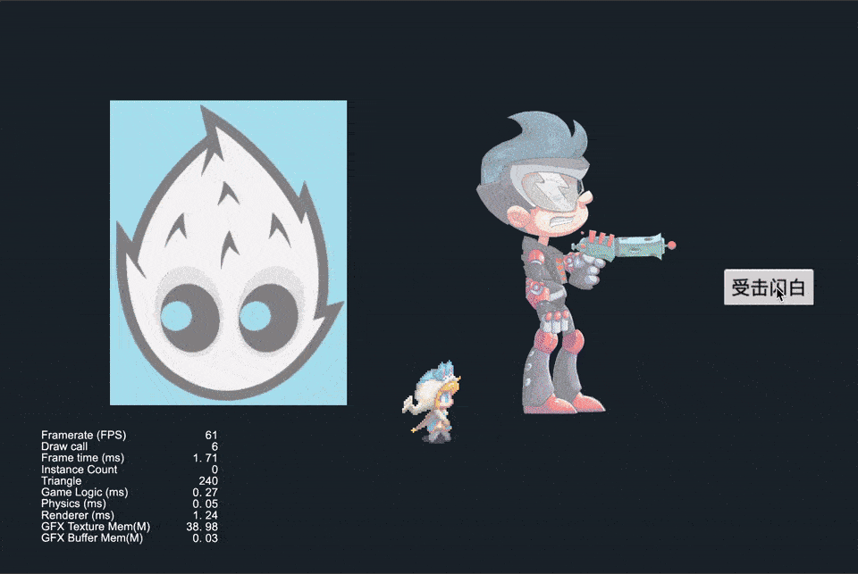

#### GlowInner
| 3 | 2D | [2D 内发光](https://gitee.com/yeshao2069/cocos-creator-shader/tree/v3.0.x/demo/Creator3.0.0_2D_Sprite_GlowInner)  | [返回顶部](#QuickLinks) |
| :---: | :---: |:---: |:---: |

#### GaussianBlur
| 4 | 2D | [高斯模糊](https://gitee.com/yeshao2069/cocos-creator-shader/tree/v3.0.x/demo/Creator3.0.0_2D_Sprite_GaussianBlur)  | [返回顶部](#QuickLinks) |
| :---: | :---: |:---: |:---: |

#### CircleAvatar
| 5 | 2D | [圆形头像](https://gitee.com/yeshao2069/cocos-creator-shader/tree/v3.0.x/demo/Creator3.0.0_2D_Sprite_CircleAvatar)  | [返回顶部](#QuickLinks) |
| :---: | :---: |:---: |:---: |

#### SpriteDissolve
| 6 | 2D | [图片溶解](https://gitee.com/yeshao2069/cocos-creator-shader/tree/v3.0.x/demo/Creator3.0.0_2D_Sprite_Dissolve)  | [返回顶部](#QuickLinks) |
| :---: | :---: |:---: |:---: |

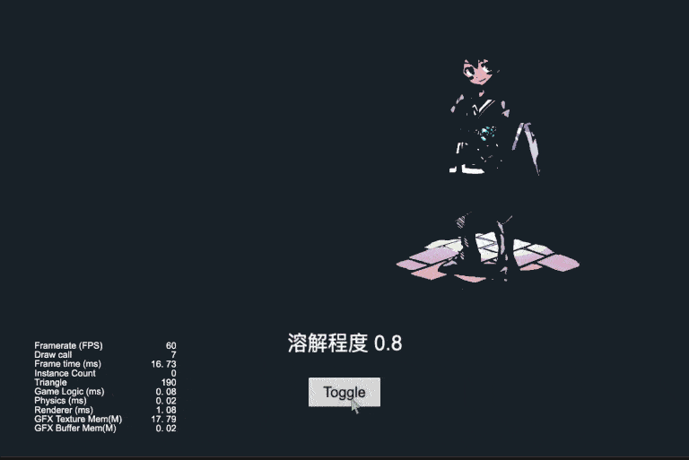

#### SpriteFilter
| 7 | 2D | [图片效果合集(老照片、置灰、冰冻、反相、动画)](https://gitee.com/yeshao2069/cocos-creator-shader/tree/v3.0.x/demo/Creator3.0.0_2D_Sprite_Filter)  | [返回顶部](#QuickLinks) |
| :---: | :---: |:---: |:---: |

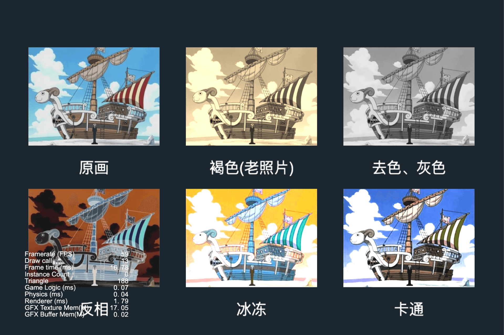

#### GradualTransitionalAlbum
| 8 | 2D | [渐变过渡的相册](https://gitee.com/yeshao2069/cocos-creator-shader/tree/v3.0.x/demo/Creator3.0.0_2D_Sprite_GradualTransitionalAlbum)  | [返回顶部](#QuickLinks) |
| :---: | :---: |:---: |:---: |

#### SpriteMosaic
| 9 | 2D | [马赛克](https://gitee.com/yeshao2069/cocos-creator-shader/tree/v3.0.x/demo/Creator3.0.0_2D_Sprite_Mosaic)  | [返回顶部](#QuickLinks) |
| :---: | :---: |:---: |:---: |

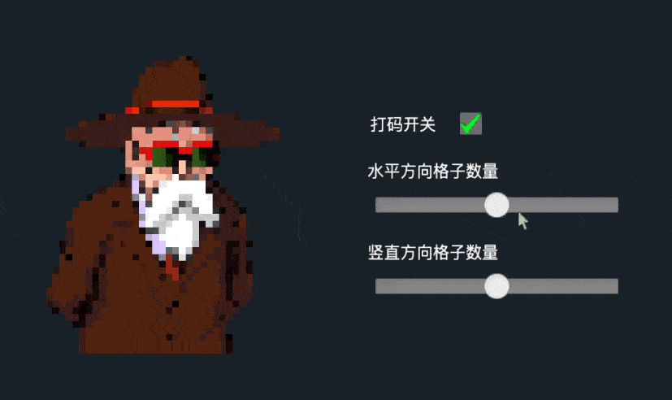

#### SpriteStreamer
| 10 | 2D | [镜面光泽](https://gitee.com/yeshao2069/cocos-creator-shader/tree/v3.0.x/demo/Creator3.0.0_2D_Sprite_Streamer)  | [返回顶部](#QuickLinks) |
| :---: | :---: |:---: |:---: |

#### WaterSpread
| 11 | 2D | [水面波纹](https://gitee.com/yeshao2069/cocos-creator-shader/tree/v3.0.x/demo/Creator3.0.0_2D_Sprite_WaterSpread)  | [返回顶部](#QuickLinks) |
| :---: | :---: |:---: |:---: |

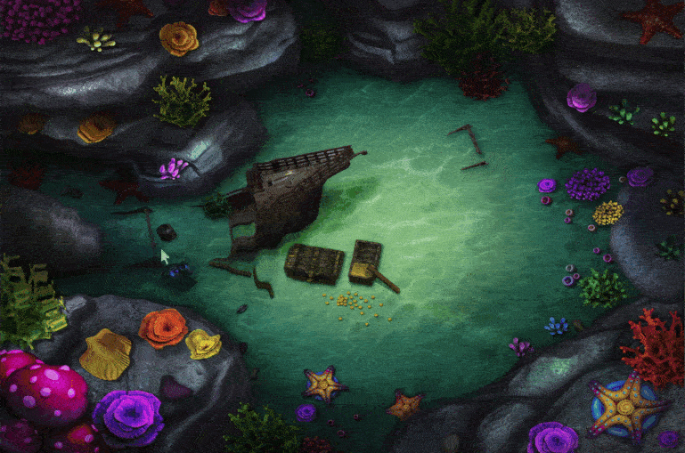

#### FollowSpot
| 12 | 2D | [灯光跟随](https://gitee.com/yeshao2069/cocos-creator-shader/tree/v3.0.x/demo/Creator3.0.0_2D_Sprite_FollowSpot)  | [返回顶部](#QuickLinks) |
| :---: | :---: |:---: |:---: |

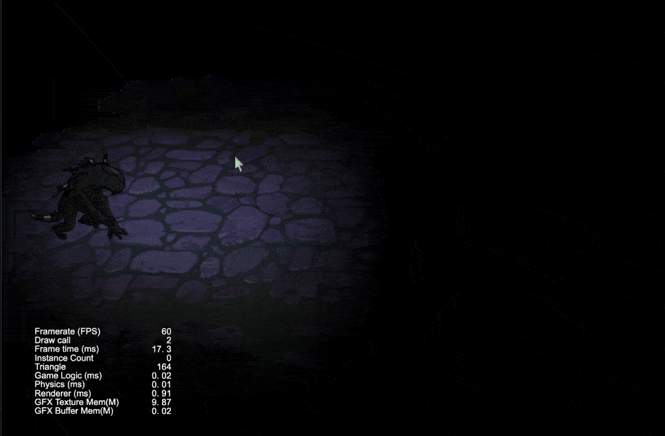

#### Metaball
| 13 | 2D | [融球](https://gitee.com/yeshao2069/cocos-creator-shader/tree/v3.0.x/demo/Creator3.0.0_2D_Sprite_Metaball)  | [返回顶部](#QuickLinks) |
| :---: | :---: |:---: |:---: |

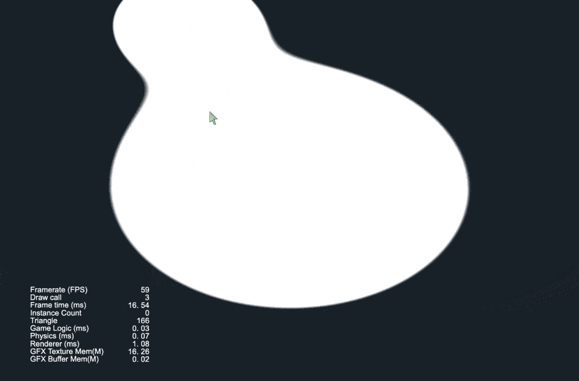

#### SpriteAblation
| 14 | 2D | [图片消融](https://gitee.com/yeshao2069/cocos-creator-shader/tree/v3.0.x/demo/Creator3.0.0_2D_Sprite_Ablation)  | [返回顶部](#QuickLinks) |
| :---: | :---: |:---: |:---: |

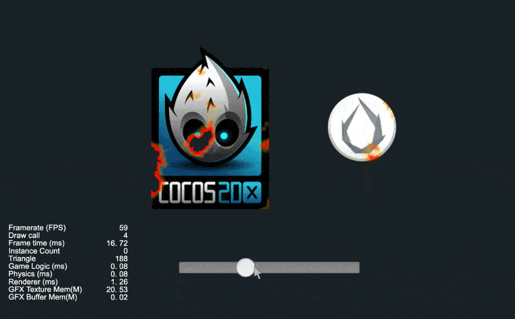

#### Sprite2DLight
| 15 | 2D | [2D 灯光](https://gitee.com/yeshao2069/cocos-creator-shader/tree/v3.0.x/demo/Creator3.0.0_2D_Sprite_Light)  | [返回顶部](#QuickLinks) |
| :---: | :---: |:---: |:---: |

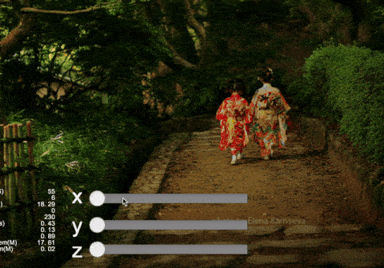

#### RoleShield
| 16 | 3D | [人物护盾](https://gitee.com/yeshao2069/cocos-creator-shader/tree/v3.0.x/demo/Creator3.0.0_3D_RoleShield)  | [返回顶部](#QuickLinks) |
| :---: | :---: |:---: |:---: |

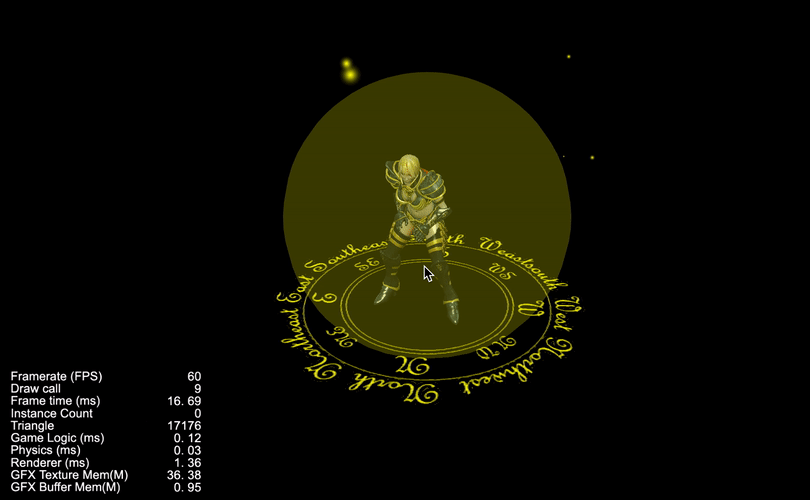

#### DrawCard
| 17 | 2D | [咪牌](https://gitee.com/yeshao2069/cocos-creator-shader/tree/v3.0.x/demo/Creator3.0.0_2D_Sprite_DrawCard)  | [返回顶部](#QuickLinks) |
| :---: | :---: |:---: |:---: |

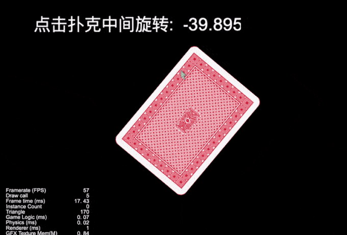

#### ButtonAmbilight
| 18 | 2D | [按钮流光](https://gitee.com/yeshao2069/cocos-creator-shader/tree/v3.0.x/demo/Creator3.0.0_2D_Sprite_ButtonAmbilight)  | [返回顶部](#QuickLinks) |
| :---: | :---: |:---: |:---: |

#### SpriteDrawRainbow
| 19 | 2D | [彩虹](https://gitee.com/yeshao2069/cocos-creator-shader/tree/v3.0.x/demo/Creator3.0.0_2D_Sprite_DrawRainbow)  | [返回顶部](#QuickLinks) |
| :---: | :---: |:---: |:---: |

#### SpriteDynamicLightAndShadow
| 20 | 2D | [动态光影](https://gitee.com/yeshao2069/cocos-creator-shader/tree/v3.0.x/demo/Creator3.0.0_2D_Sprite_DynamicLightAndShadow)  | [返回顶部](#QuickLinks) |
| :---: | :---: |:---: |:---: |

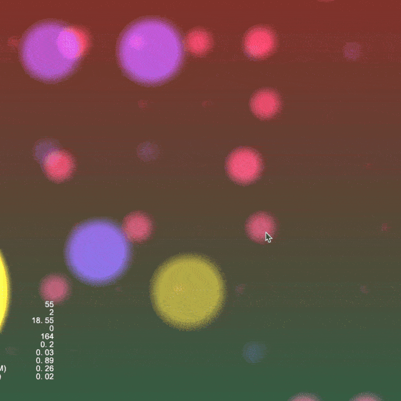

#### SpriteHighLight
| 21 | 2D | [图片高亮](https://gitee.com/yeshao2069/cocos-creator-shader/tree/v3.0.x/demo/Creator3.0.0_2D_Sprite_HighLight)  | [返回顶部](#QuickLinks) |
| :---: | :---: |:---: |:---: |

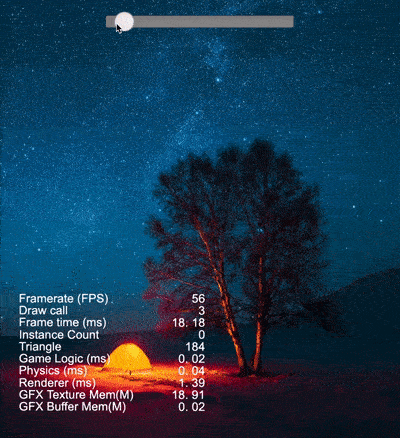

#### RoleHighLight
| 22 | 3D | [模型高亮](https://gitee.com/yeshao2069/cocos-creator-shader/tree/v3.0.x/demo/Creator3.0.0_3D_RoleHighLight)  | [返回顶部](#QuickLinks) |
| :---: | :---: |:---: |:---: |

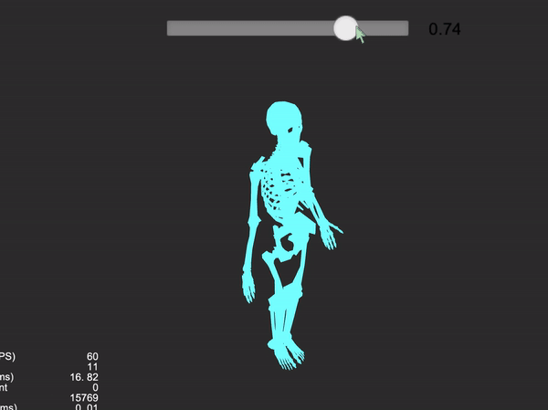

#### WindBlowingThrough2D
| 23 | 2D | [植物受风摆动](https://gitee.com/yeshao2069/cocos-creator-shader/tree/v3.0.x/demo/Creator3.0.0_2D_Sprite_WindBlowing)  | [返回顶部](#QuickLinks) |
| :---: | :---: |:---: |:---: |

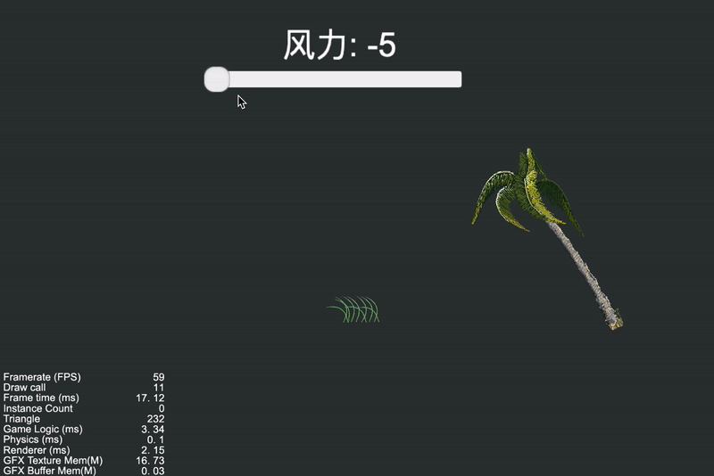

#### SpriteRadiusShader
| 24 | 2D | [自定义头像](https://gitee.com/yeshao2069/cocos-creator-shader/tree/v3.0.x/demo/Creator3.0.0_2D_Sprite_CustomizedAvatar)  | [返回顶部](#QuickLinks) |
| :---: | :---: |:---: |:---: |

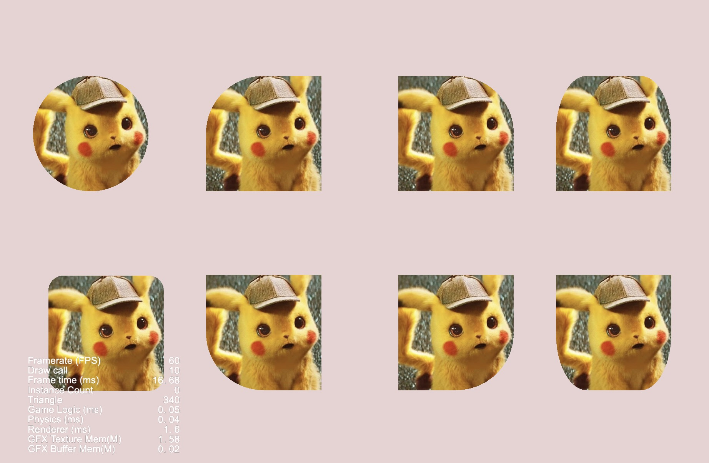

## Mark
Cocos Creator 3.0.x 版本列举效果 24 种，会同步更新到 Cocos Creator 3.4.x 版本，后续 Cocos Creator 3.0.x 将不会同步新的效果，请移步到 3.4.x 版本查看最新效果。