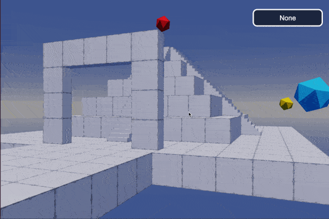
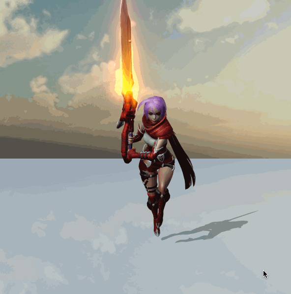
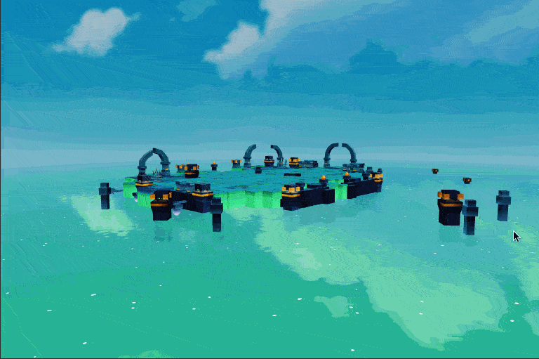
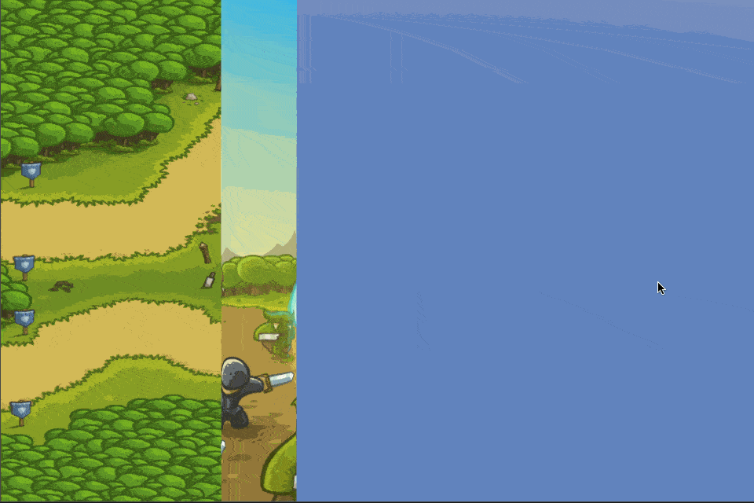
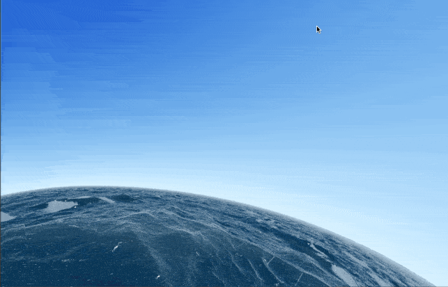

## CocosCreatorShader
### Purpose
CocosCreatorShader intends to help users who do not know Shader quickly understand how to use Cocos Effect.
### Version
Cocos Creator v3.7.x

### 2D
| NO1 | Proj1 | NO2 | Proj2 | NO3 | Proj3 | NO4 | Proj4 |
| :---: | :--- | :---: | :--- | :---: | :--- | :---: | :--- |
| 1 | [Flash Light](#flashlight) | 2 | [Hit White](#hitwhite) | 3 | [Glow Inner (Sprite)](#glowinner) | 4 | [Gaussian Blur](#gaussianblur) |
| 5 | [Circle Avatar (Sprite)](#circleavatar) | 6 | [Dissolve (Sprite)](#spritedissolve) | 7 | [Sprite Filter](#spritefilter) | 8 | [Gradual Transitional Album](#gradualtransitionalalbum) |
| 9 | [Mosaic (Sprite)](#spritemosaic) | 10 | [Streamer (Sprite)](#spritestreamer) | 11 | [Water Spread](#waterspread) | 12 | [Follow Spot](#followspot) |
| 13 | [Metaball (Sprite)](#metaball) | 14 | [Ablation (Sprite)](#spriteablation) | 15 | [2D Light (Sprite)](#sprite2dlight) | 16 | [Draw Card (Sprite)](#drawcard) |
| 17 | [Button Ambilight](#buttonambilight) | 18 | [Draw Rainbow](#spritedrawrainbow) | 19 | [Dynamic Light And Shadow](#spritedynamiclightandshadow) | 20 | [High Light (Sprite)](#spritehighlight) |
| 21 | [Wind Blowing (Sprite)](#windblowingthrough2d) | 22 | [Customized Avatar](#spriteradiusshader) | 23 | [Loading (Sprite)](#spriteloading) | 24 | [Wave (Sprite)](#spritewave) |
| 25 | [Sine Wave (Sprite)](#spritesinewave) | 26 | [Glow Inner (Sprite) ver2](#glowinnerv2) | 27 | [Loading Style (Sprite)](#loadingstyle) | 28 | [Glow Outter (Sprite)](#glowoutter) |
| 29 | [Fire Stroke (Sprite)](#firestroke) | 30 | [Loop Tunnel](#looptunnel) | 31 | [Transition (Sprite)](#transition) | 32 | [Moon And Star](#moonstar) |
| 33 | [Arrow Guide Line](#arrowguideline) | 34 | [Moving Background](#movingbackground) | 35 | [Rect Head Loading](#rectdraw) | 36 | [River](#river) |
| 37 | [Card Perspective](#cardperspective) | 38 | [Valentine Day](#valentineday) | 39 | [Amazing Color](#amazingcolor) | 40 | [Obsession](#obsession) |
| 41 | [Light Circle](#lightcircle) | 42 | [Light Net](#lightnet) | 43 | [Light Run](#lightrun) | 44 | [Heart Beat](#heartbeat) |
| 45 | [Super Mario (Sprite)](#supermario) | 46 | [Swirling Dots](#swirlingdots) | 47 | [Deform Flower](#deformflower) | 48 | [Star Background](#starbackground) |
| 49 | [Grassy (Sprite)](#grassy) | 50 | [Glow Circle](#glowcircle) | 51 | [Tweaked](#tweaked) | 52 | [Shader Book Effect](#shaderbook) |
| 53 | [Rain](#rain) | 54 | [Clouds](#cloud) | 55 | [Draw Smile](#smile) | 56 | [Emoji Style Smile](#emojismile) |
| 57 | [Clover](#clover) | 58 | [Color Circle](#colorcircle) | 59 | [Head Frame](#headframe) | 60 | [Outer Edge Of Text](#outeredgeoftext) |
| 61 | [Octagrams](#octagrams) | 62 | [Fractal Trees](#fractaltrees) | 63 | [Plasma Globe](#plasmaglobe) | 64 | [Star Nest](#starnest) |
| 65 | [Cyber Fuji](#cyberfuji) | 66 | [Retro Sun](#retrosun) | 67 | [Down The Drain](#downthedrain) | 68 | [The Universe Within](#universewithin) |
| 69 | [Sprite Gradient](#spritegradient) | 70 | [Sprite Shadow](#spriteshadow) | 71 | [Reel Unfolding And Closing](#reelunfoldingandclosing) | 72 | [Edge High Light](#edgehighlight) |
| 73 | [Cloak Of The Underworld](#cloakoftheunderworld) | 74 | [2D Fog](#fog2d) | 75 | [Label Cocos](#labelcocos) | 76 | [Jelly (Sprite)](#jelly) |
| 77 | [2D Light Rays](#lightrays2d) | 78 | [Blur 2D (Sprite)](#blur2d) | 79 | [Blue Sea](#bluesea) | 80 | [Light And Shadow](#lightandshadow) |
| 81 | [Dancing Ball](#dancingball) | 82 | [Strokes Are Dancing](#strokesaredancing) |

### 3D
| NO1 | Proj1 | NO2 | Proj2 | NO3 | Proj3 | NO4 | Proj4 |
| :---: | :--- | :---: | :--- | :---: | :--- | :---: | :--- |
| 1 | [Role Shield](#roleshield) | 2 | [High Light (Model)](#rolehighlight) | 3 | [Occlusion Perspective (Model)](#occlusionperspective) | 4 | [Low Poly Style Water](#lowpolywater) |
| 5 | [Noise Style Water](#noisewater) | 6 | [Glow Inner (Model)](#modelinnerglow) | 7 | [Outline (Model)](#modeloutline) | 8 | [Dissolve (Model)](#modeldissolve) |
| 9 | [Sea Of Clouds](#seaofclouds) | 10 | [Erase (Model)](#modelerase) | 11 | [UV Animation](#uvanimation) | 12 | [UV Animation Blend](#uvanimationblend) |
| 13 | [UV Animation Distortion](#uvanimationdistortion) | 14 | [UV Animation Move And Distortion](#uvanimationmovedistortion) | 15 | [Distortion (Model)](#modeldistortion) | 16 | [Model Effect](#modeleffect) |
| 17 | [Guide Line (3D)](#guideline) | 18 | [Perspective (Model)](#modelperspective) | 19 | [Snap Shot](#snapshot) | 20 | [Rim Light (Model)](#modelrimlight) |
| 21 | [Weapon Glow](#weaponglow) | 22 | [Model Bloom](#modelbloom) | 23 | [Rain Drop](#raindrop) | 24 | [Graffiti](#graffiti) |
| 25 | [Role Motion Vertex](#rolemotionvertex) | 26 | [SSAO](#ssao) | 27 | [SSR](#ssr) | 28 | [Sonar](#sonar) |
| 29 | [Cartoon Water](#cartoonwater) | 30 | [High Cartoon Water](#cartoonwaterhigh) | 31 | [3D Circle Avatar](#circleavatar3d) | 32 | [Hologram](#hologram) |

## Examples
### FlashLight
| No. | Type | Project | Creator Version | Back To Top | Mode | Mark |
| :---: | :---: | :---: | :---: | :---: | :---: | :---: |
| 1.1 | 2D | [Flash Light](https://github.com/yeshao2069/CocosCreatorShader/tree/v3.7.x/demo/2d/Creator3.7.0_2D_FlashLight)  | 3.7.0 | [Back To Top](#2d) | Low Level | Empty |

### HitWhite
| No. | Type | Project | Creator Version | Back To Top | Mode | Mark |
| :---: | :---: | :---: | :---: | :---: | :---: | :---: |
| 1.2 | 2D | [Hit White](https://github.com/yeshao2069/CocosCreatorShader/tree/v3.7.x/demo/2d/Creator3.7.0_2D_HitWhite)  | 3.7.0 | [Back To Top](#2d) | Low Level | Empty |

### GlowInner
| No. | Type | Project | Creator Version | Back To Top | Mode | Mark |
| :---: | :---: | :---: | :---: | :---: | :---: | :---: |
| 1.3 | 2D | [Glow Inner (Sprite)](https://github.com/yeshao2069/CocosCreatorShader/tree/v3.7.x/demo/2d/Creator3.7.0_2D_GlowInner) | 3.7.0 | [Back To Top](#2d) | Low Level | Empty |

### GaussianBlur
| No. | Type | Project | Creator Version | Back To Top | Mode | Mark |
| :---: | :---: | :---: | :---: | :---: | :---: | :---: |
| 1.4 | 2D | [Gaussian Blur](https://github.com/yeshao2069/CocosCreatorShader/tree/v3.7.x/demo/2d/Creator3.7.0_2D_GaussianBlur)  | 3.7.0 | [Back To Top](#2d) | Low Level | Empty |

### CircleAvatar
| No. | Type | Project | Creator Version | Back To Top | Mode | Mark |
| :---: | :---: | :---: | :---: | :---: | :---: | :---: |
| 1.5 | 2D | [Circle Avatar (Sprite)](https://github.com/yeshao2069/CocosCreatorShader/tree/v3.7.x/demo/2d/Creator3.7.0_2D_CircleAvatar)  | 3.7.0 | [Back To Top](#2d) | Low Level | Empty |

### SpriteDissolve
| No. | Type | Project | Creator Version | Back To Top | Mode | Mark |
| :---: | :---: | :---: | :---: | :---: | :---: | :---: |
| 1.6 | 2D | [Dissolve (Sprite)](https://github.com/yeshao2069/CocosCreatorShader/tree/v3.7.x/demo/2d/Creator3.7.0_2D_Dissolve)  | 3.7.0 | [Back To Top](#2d) | Low Level | Empty |

### SpriteFilter
| No. | Type | Project | Creator Version | Back To Top | Mode | Mark |
| :---: | :---: | :---: | :---: | :---: | :---: | :---: |
| 1.7 | 2D | [Sprite Filter](https://github.com/yeshao2069/CocosCreatorShader/tree/v3.7.x/demo/2d/Creator3.7.0_2D_Filter)  | 3.7.0 | [Back To Top](#2d) | Low Level | Empty |

### GradualTransitionalAlbum
| No. | Type | Project | Creator Version | Back To Top | Mode | Mark |
| :---: | :---: | :---: | :---: | :---: | :---: | :---: |
| 1.8 | 2D | [Gradual Transitional Album](https://github.com/yeshao2069/CocosCreatorShader/tree/v3.7.x/demo/2d/Creator3.7.0_2D_GradualTransitionalAlbum)  | 3.7.0 | [Back To Top](#2d) | Low Level | Empty |

### SpriteMosaic
| No. | Type | Project | Creator Version | Back To Top | Mode | Mark |
| :---: | :---: | :---: | :---: | :---: | :---: | :---: |
| 1.9 | 2D | [Mosaic (Sprite)](https://github.com/yeshao2069/CocosCreatorShader/tree/v3.7.x/demo/2d/Creator3.7.0_2D_Mosaic)  | 3.7.0 | [Back To Top](#2d) | Low Level | Empty |

### SpriteStreamer
| No. | Type | Project | Creator Version | Back To Top | Mode | Mark |
| :---: | :---: | :---: | :---: | :---: | :---: | :---: |
| 1.10 | 2D | [Streamer (Sprite)](https://github.com/yeshao2069/CocosCreatorShader/tree/v3.7.x/demo/2d/Creator3.7.0_2D_Streamer)  | 3.7.0 | [Back To Top](#2d) | Low Level | Empty |

### WaterSpread
| No. | Type | Project | Creator Version | Back To Top | Mode | Mark |
| :---: | :---: | :---: | :---: | :---: | :---: | :---: |
| 1.11 | 2D | [Water Spread](https://github.com/yeshao2069/CocosCreatorShader/tree/v3.7.x/demo/2d/Creator3.7.0_2D_WaterSpread)  | 3.7.0 | [Back To Top](#2d) | Low Level | Empty |

### FollowSpot
| No. | Type | Project | Creator Version | Back To Top | Mode | Mark |
| :---: | :---: | :---: | :---: | :---: | :---: | :---: |
| 1.12 | 2D | [Follow Spot](https://github.com/yeshao2069/CocosCreatorShader/tree/v3.7.x/demo/2d/Creator3.7.0_2D_FollowSpot)  | 3.7.0 | [Back To Top](#2d) | Low Level | Empty |

### Metaball
| No. | Type | Project | Creator Version | Back To Top | Mode | Mark |
| :---: | :---: | :---: | :---: | :---: | :---: | :---: |
| 1.13 | 2D | [Metaball (Sprite)](https://github.com/yeshao2069/CocosCreatorShader/tree/v3.7.x/demo/2d/Creator3.7.0_2D_Metaball)  | 3.7.0 | [Back To Top](#2d) | Low Level | Empty |

### SpriteAblation
| No. | Type | Project | Creator Version | Back To Top | Mode | Mark |
| :---: | :---: | :---: | :---: | :---: | :---: | :---: |
| 1.14 | 2D | [Ablation (Sprite)](https://github.com/yeshao2069/CocosCreatorShader/tree/v3.7.x/demo/2d/Creator3.7.0_2D_Ablation)  | 3.7.0 | [Back To Top](#2d) | Low Level | Empty |

### Sprite2DLight
| No. | Type | Project | Creator Version | Back To Top | Mode | Mark |
| :---: | :---: | :---: | :---: | :---: | :---: | :---: |
| 1.15 | 2D | [2D Light (Sprite)](https://github.com/yeshao2069/CocosCreatorShader/tree/v3.7.x/demo/2d/Creator3.7.0_2D_Light)  | 3.7.0 | [Back To Top](#2d) | Low Level | Empty |

### DrawCard
| No. | Type | Project | Creator Version | Back To Top | Mode | Mark |
| :---: | :---: | :---: | :---: | :---: | :---: | :---: |
| 1.16 | 2D | [Draw Card (Sprite)](https://github.com/yeshao2069/CocosCreatorShader/tree/v3.7.x/demo/2d/Creator3.7.0_2D_DrawCard)  | 3.7.0 | [Back To Top](#2d) | Middle Level | Empty |

### ButtonAmbilight
| No. | Type | Project | Creator Version | Back To Top | Mode | Mark |
| :---: | :---: | :---: | :---: | :---: | :---: | :---: |
| 1.17 | 2D | [Button Ambilight](https://github.com/yeshao2069/CocosCreatorShader/tree/v3.7.x/demo/2d/Creator3.7.0_2D_ButtonAmbilight)  | 3.7.0 | [Back To Top](#2d) | Low Level | Empty |

### SpriteDrawRainbow
| No. | Type | Project | Creator Version | Back To Top | Mode | Mark |
| :---: | :---: | :---: | :---: | :---: | :---: | :---: |
| 1.18 | 2D | [Draw Rainbow](https://github.com/yeshao2069/CocosCreatorShader/tree/v3.7.x/demo/2d/Creator3.7.0_2D_DrawRainbow)  | 3.7.0 | [Back To Top](#2d) | Low Level | Empty |

### SpriteDynamicLightAndShadow
| No. | Type | Project | Creator Version | Back To Top | Mode | Mark |
| :---: | :---: | :---: | :---: | :---: | :---: | :---: |
| 1.19 | 2D | [Dynamic Light And Shadow](https://github.com/yeshao2069/CocosCreatorShader/tree/v3.7.x/demo/2d/Creator3.7.0_2D_DynamicLightAndShadow)  | 3.7.0 | [Back To Top](#2d) | Low Level | Empty |

### SpriteHighLight
| No. | Type | Project | Creator Version | Back To Top | Mode | Mark |
| :---: | :---: | :---: | :---: | :---: | :---: | :---: |
| 1.20 | 2D | [High Light (Sprite)](https://github.com/yeshao2069/CocosCreatorShader/tree/v3.7.x/demo/2d/Creator3.7.0_2D_HighLight)  | 3.7.0 | [Back To Top](#2d) | Low Level | Empty |

### WindBlowingThrough2D
| No. | Type | Project | Creator Version | Back To Top | Mode | Mark |
| :---: | :---: | :---: | :---: | :---: | :---: | :---: |
| 1.21 | 2D | [Wind Blowing (Sprite)](https://github.com/yeshao2069/CocosCreatorShader/tree/v3.7.x/demo/2d/Creator3.7.0_2D_WindBlowing)  | 3.7.0 | [Back To Top](#2d) | Low Level | Empty |

### SpriteRadiusShader
| No. | Type | Project | Creator Version | Back To Top | Mode | Mark |
| :---: | :---: | :---: | :---: | :---: | :---: | :---: |
| 1.22 | 2D | [Customized Avatar](https://github.com/yeshao2069/CocosCreatorShader/tree/v3.7.x/demo/2d/Creator3.7.0_2D_CustomizedAvatar)  | 3.7.0 | [Back To Top](#2d) | Low Level | Empty |

### SpriteLoading
| No. | Type | Project | Creator Version | Back To Top | Mode | Mark |
| :---: | :---: | :---: | :---: | :---: | :---: | :---: |
| 1.23 | 2D | [Loading (Sprite)](https://github.com/yeshao2069/CocosCreatorShader/tree/v3.7.x/demo/2d/Creator3.7.0_2D_Loading)  | 3.7.0 | [Back To Top](#2d) | Low Level | Empty |

### SpriteWave
| No. | Type | Project | Creator Version | Back To Top | Mode | Mark |
| :---: | :---: | :---: | :---: | :---: | :---: | :---: |
| 1.24 | 2D | [Wave (Sprite)](https://github.com/yeshao2069/CocosCreatorShader/tree/v3.7.x/demo/2d/Creator3.7.0_2D_Sprite_Wave)  | 3.7.0 | [Back To Top](#2d) | Low Level | Empty |

### SpriteSineWave
| No. | Type | Project | Creator Version | Back To Top | Mode | Mark |
| :---: | :---: | :---: | :---: | :---: | :---: | :---: |
| 1.25 | 2D | [Sine Wave (Sprite)](https://github.com/yeshao2069/CocosCreatorShader/tree/v3.7.x/demo/2d/Creator3.7.0_2D_SineWave)  | 3.7.0 | [Back To Top](#2d) | Low Level | Empty |

### GlowInnerV2
| No. | Type | Project | Creator Version | Back To Top | Mode | Mark |
| :---: | :---: | :---: | :---: | :---: | :---: | :---: |
| 1.26 | 2D | [Glow Inner (Sprite) ver2](https://github.com/yeshao2069/CocosCreatorShader/tree/v3.7.x/demo/2d/Creator3.7.0_2D_GlowInnerv2) | 3.7.0 | [Back To Top](#2d) | Low Level | Empty |

### LoadingStyle
| No. | Type | Project | Creator Version | Back To Top | Mode | Mark |
| :---: | :---: | :---: | :---: | :---: | :---: | :---: |
| 1.27 | 2D | [Loading Style (Sprite)](https://github.com/yeshao2069/CocosCreatorShader/tree/v3.7.x/demo/2d/Creator3.7.0_2D_LoadingStyle) | 3.7.0 | [Back To Top](#2d) | Low Level | Empty |

### GlowOutter
| No. | Type | Project | Creator Version | Back To Top | Mode | Mark |
| :---: | :---: | :---: | :---: | :---: | :---: | :---: |
| 1.28 | 2D | [Glow Outter (Sprite)](https://github.com/yeshao2069/CocosCreatorShader/tree/v3.7.x/demo/2d/Creator3.7.0_2D_GlowOutter) | 3.7.0 | [Back To Top](#2d) | Low Level | Empty |

### FireStroke
| No. | Type | Project | Creator Version | Back To Top | Mode | Mark |
| :---: | :---: | :---: | :---: | :---: | :---: | :---: |
| 1.29 | 2D | [Fire Stroke (Sprite)](https://github.com/yeshao2069/CocosCreatorShader/tree/v3.7.x/demo/2d/Creator3.7.0_2D_FireStroke) | 3.7.0 | [Back To Top](#2d) | Low Level | Empty |

### LoopTunnel
| No. | Type | Project | Creator Version | Back To Top | Mode | Mark |
| :---: | :---: | :---: | :---: | :---: | :---: | :---: |
| 1.30 | 2D | [Loop Tunnel](https://github.com/yeshao2069/CocosCreatorShader/tree/v3.7.x/demo/2d/Creator3.7.0_2D_LoopTunnel) | 3.7.0 | [Back To Top](#2d) | Low Level | Empty |

### RoleShield
| No. | Type | Project | Creator Version | Back To Top | Mode | Mark |
| :---: | :---: | :---: | :---: | :---: | :---: | :---: |
| 2.1 | 3D | [Role Shield](https://github.com/yeshao2069/CocosCreatorShader/tree/v3.7.x/demo/3d/Creator3.7.0_3D_RoleShield)  | 3.7.0 | [Back To Top](#3d) | Low Level | Empty |

### RoleHighLight
| No. | Type | Project | Creator Version | Back To Top | Mode | Mark |
| :---: | :---: | :---: | :---: | :---: | :---: | :---: |
| 2.2 | 3D | [High Light (Model)](https://github.com/yeshao2069/CocosCreatorShader/tree/v3.7.x/demo/3d/Creator3.7.0_3D_HighLight)  | 3.7.0 | [Back To Top](#3d) | Low Level | Empty |

### OcclusionPerspective
| No. | Type | Project | Creator Version | Back To Top | Mode | Mark |
| :---: | :---: | :---: | :---: | :---: | :---: | :---: |
| 2.3 | 3D | [Occlusion Perspective (Model)](https://github.com/yeshao2069/CocosCreatorShader/tree/v3.7.x/demo/3d/Creator3.7.0_3D_OcclusionPerspective)  | 3.7.0 | [Back To Top](#3d) | Low Level | Empty |

### LowPolyWater
| No. | Type | Project | Creator Version | Back To Top | Mode | Mark |
| :---: | :---: | :---: | :---: | :---: | :---: | :---: |
| 2.4 | 3D | [Low Poly Style Water](https://github.com/yeshao2069/CocosCreatorShader/tree/v3.7.x/demo/3d/Creator3.7.0_3D_LowPolyStyleWater) | 3.7.0 | [Back To Top](#3d) | Low Level | Empty |

### NoiseWater
| No. | Type | Project | Creator Version | Back To Top | Mode | Mark |
| :---: | :---: | :---: | :---: | :---: | :---: | :---: |
| 2.5 | 3D | [Noise Style Water](https://github.com/yeshao2069/CocosCreatorShader/tree/v3.7.x/demo/3d/Creator3.7.0_3D_NoiseWater) | 3.7.0 | [Back To Top](#3d) | Low Level | Empty |

### ModelInnerGlow
| No. | Type | Project | Creator Version | Back To Top | Mode | Mark |
| :---: | :---: | :---: | :---: | :---: | :---: | :---: |
| 2.6 | 3D | [Glow Inner (Model)](https://github.com/yeshao2069/CocosCreatorShader/tree/v3.7.x/demo/3d/Creator3.7.0_3D_ModelInnerGlow) | 3.7.0 | [Back To Top](#3d) | Low Level |  |

### ModelOutline
| No. | Type | Project | Creator Version | Back To Top | Mode | Mark |
| :---: | :---: | :---: | :---: | :---: | :---: | :---: |
| 2.7 | 3D | [Outline (Model)](https://github.com/yeshao2069/CocosCreatorShader/tree/v3.7.x/demo/3d/Creator3.7.0_3D_ModelOutline) | 3.7.0 | [Back To Top](#3d) | Low Level |  |

### ModelDissolve
| No. | Type | Project | Creator Version | Back To Top | Mode | Mark |
| :---: | :---: | :---: | :---: | :---: | :---: | :---: |
| 2.8 | 3D | [Dissolve (Model)](https://github.com/yeshao2069/CocosCreatorShader/tree/v3.7.x/demo/3d/Creator3.7.0_3D_ModelDissolve) | 3.7.0 | [Back To Top](#3d) | Low Level | Empty |

### SeaOfClouds
| No. | Type | Project | Creator Version | Back To Top | Mode | Mark |
| :---: | :---: | :---: | :---: | :---: | :---: | :---: |
| 2.9 | 3D | [Sea Of Clouds](https://github.com/yeshao2069/CocosCreatorShader/tree/v3.7.x/demo/3d/Creator3.7.0_3D_SeaOfClouds) | 3.7.0 | [Back To Top](#3d) | Low Level | Empty |

### ModelErase
| No. | Type | Project | Creator Version | Back To Top | Mode | Mark |
| :---: | :---: | :---: | :---: | :---: | :---: | :---: |
| 2.10 | 3D | [Erase (Model)](https://github.com/yeshao2069/CocosCreatorShader/tree/v3.7.x/demo/3d/Creator3.7.0_3D_ModelErase) | 3.7.0 | [Back To Top](#3d) | Middle Level | Empty |

### UVAnimation
| No. | Type | Project | Creator Version | Back To Top | Mode | Mark |
| :---: | :---: | :---: | :---: | :---: | :---: | :---: |
| 2.11 | 3D | [UV Animation](https://github.com/yeshao2069/CocosCreatorShader/tree/v3.7.x/demo/3d/Creator3.7.0_3D_uvAnimation) | 3.7.0 | [Back To Top](#3d) | Low Level | Empty |

### UVAnimationBlend
| No. | Type | Project | Creator Version | Back To Top | Mode | Mark |
| :---: | :---: | :---: | :---: | :---: | :---: | :---: |
| 2.12 | 3D | [UV Animation Blend](https://github.com/yeshao2069/CocosCreatorShader/tree/v3.7.x/demo/3d/Creator3.7.0_3D_uvAnimationBlend) | 3.7.0 | [Back To Top](#3d) | Low Level | Empty |

### UVAnimationDistortion
| No. | Type | Project | Creator Version | Back To Top | Mode | Mark |
| :---: | :---: | :---: | :---: | :---: | :---: | :---: |
| 2.13 | 3D | [UV Animation Distortion](https://github.com/yeshao2069/CocosCreatorShader/tree/v3.7.x/demo/3d/Creator3.7.0_3D_uvAnimationDistortion) | 3.7.0 | [Back To Top](#3d) | Low Level | Empty |

### UVAnimationMoveDistortion
| No. | Type | Project | Creator Version | Back To Top | Mode | Mark |
| :---: | :---: | :---: | :---: | :---: | :---: | :---: |
| 2.14 | 3D | [UV Animation Move And Distortion](https://github.com/yeshao2069/CocosCreatorShader/tree/v3.7.x/demo/3d/Creator3.7.0_3D_uvAnimationMoveDistortion) | 3.7.0 | [Back To Top](#3d) | Low Level | Empty |

### ModelDistortion
| No. | Type | Project | Creator Version | Back To Top | Mode | Mark |
| :---: | :---: | :---: | :---: | :---: | :---: | :---: |
| 2.15 | 3D | [Distortion (Model)](https://github.com/yeshao2069/CocosCreatorShader/tree/v3.7.x/demo/3d/Creator3.7.0_3D_ModelDistortion) | 3.7.0 | [Back To Top](#3d) | Low Level | Empty |

### ModelEffect
| No. | Type | Project | Creator Version | Back To Top | Mode | Mark |
| :---: | :---: | :---: | :---: | :---: | :---: | :---: |
| 2.16 | 3D | [Model Effect](https://github.com/yeshao2069/CocosCreatorShader/tree/v3.7.x/demo/3d/Creator3.7.0_3D_ModelEffect) | 3.7.0 | [Back To Top](#3d) | Low Level | Empty |

### GuideLine
| No. | Type | Project | Creator Version | Back To Top | Mode | Mark |
| :---: | :---: | :---: | :---: | :---: | :---: | :---: |
| 2.17 | 3D | [Guide Line (3D)](https://github.com/yeshao2069/CocosCreatorShader/tree/v3.7.x/demo/3d/Creator3.7.0_3D_GuideLine) | 3.7.0 | [Back To Top](#3d) | Low Level | Empty |

### ModelPerspective
| No. | Type | Project | Creator Version | Back To Top | Mode | Mark |
| :---: | :---: | :---: | :---: | :---: | :---: | :---: |
| 2.18 | 3D | [Perspective (Model)](https://github.com/yeshao2069/CocosCreatorShader/tree/v3.7.x/demo/3d/Creator3.7.0_3D_ModelPerspective) | 3.7.0 | [Back To Top](#3d) | Low Level | Empty |

### Snapshot
| No. | Type | Project | Creator Version | Back To Top | Mode | Mark |
| :---: | :---: | :---: | :---: | :---: | :---: | :---: |
| 2.19 | 3D | [Snap Shot](https://github.com/yeshao2069/CocosCreatorShader/tree/v3.7.x/demo/3d/Creator3.7.0_3D_Snapshot) | 3.7.0 | [Back To Top](#3d) | Middle Level | Empty |

### ModelRimLight
| No. | Type | Project | Creator Version | Back To Top | Mode | Mark |
| :---: | :---: | :---: | :---: | :---: | :---: | :---: |
| 2.20 | 3D | [Rim Light (Model)](https://github.com/yeshao2069/CocosCreatorShader/tree/v3.7.x/demo/3d/Creator3.7.0_3D_ModelRimLight) | 3.7.0 | [Back To Top](#3d) | Low Level | Empty |

### WeaponGlow
| No. | Type | Project | Creator Version | Back To Top | Mode | Mark |
| :---: | :---: | :---: | :---: | :---: | :---: | :---: |
| 2.21 | 3D | [Weapon Glow](https://github.com/yeshao2069/CocosCreatorShader/tree/v3.7.x/demo/3d/Creator3.7.0_3D_WeaponGlow) | 3.7.0 | [Back To Top](#3d) | Low Level | Empty |

### ModelBloom
| No. | Type | Project | Creator Version | Back To Top | Mode | Mark |
| :---: | :---: | :---: | :---: | :---: | :---: | :---: |
| 2.22 | 3D | [Model Bloom](https://github.com/yeshao2069/CocosCreatorShader/tree/v3.7.x/demo/3d/Creator3.7.0_3D_ModelBloom) | 3.7.0 | [Back To Top](#3d) | Low Level | Empty |

### RainDrop
| No. | Type | Project | Creator Version | Back To Top | Mode | Mark |
| :---: | :---: | :---: | :---: | :---: | :---: | :---: |
| 2.23 | 3D | [Rain Drop](https://github.com/yeshao2069/CocosCreatorShader/tree/v3.7.x/demo/3d/Creator3.7.0_3D_RainDrop) | 3.7.0 | [Back To Top](#3d) | Low Level | Empty |

### Graffiti
| No. | Type | Project | Creator Version | Back To Top | Mode | Mark |
| :---: | :---: | :---: | :---: | :---: | :---: | :---: |
| 2.24 | 3D | [Graffiti](https://github.com/yeshao2069/CocosCreatorShader/tree/v3.7.x/demo/3d/Creator3.7.0_3D_Graffiti) | 3.7.0 | [Back To Top](#3d) | Low Level | Empty |

### RoleMotionVertex
| No. | Type | Project | Creator Version | Back To Top | Mode | Mark |
| :---: | :---: | :---: | :---: | :---: | :---: | :---: |
| 2.25 | 3D | [Role Motion Vertex](https://github.com/yeshao2069/CocosCreatorShader/tree/v3.7.x/demo/3d/Creator3.7.0_3D_RoleMotionVertex) | 3.7.0 | [Back To Top](#3d) | Low Level | Empty |

### SSAO
| No. | Type | Project | Creator Version | Back To Top | Mode | Mark |
| :---: | :---: | :---: | :---: | :---: | :---: | :---: |
| 2.26 | 3D | [SSAO](https://github.com/yeshao2069/CocosCreatorShader/tree/v3.7.x/demo/3d/Creator3.7.0_3D_DeferredPipeline_SSAO) | 3.7.0 | [Back To Top](#3d) | Middle Level | Custom Render Pipeline |

### SSR
| No. | Type | Project | Creator Version | Back To Top | Mode | Mark |
| :---: | :---: | :---: | :---: | :---: | :---: | :---: |
| 2.27 | 3D | [SSR](https://github.com/yeshao2069/CocosCreatorShader/tree/v3.7.x/demo/3d/Creator3.7.0_3D_DeferredPipeline_SSR) | 3.7.0 | [Back To Top](#3d) | Middle Level | Custom Render Pipeline |

### Sonar
| No. | Type | Project | Creator Version | Back To Top | Mode | Mark |
| :---: | :---: | :---: | :---: | :---: | :---: | :---: |
| 2.28 | 3D | [Sonar](https://github.com/yeshao2069/CocosCreatorShader/tree/v3.7.x/demo/3d/Creator3.7.0_3D_Sonar) | 3.7.0 | [Back To Top](#3d) | Middle Level | Empty |

### CartoonWater
| No. | Type | Project | Creator Version | Back To Top | Mode | Mark |
| :---: | :---: | :---: | :---: | :---: | :---: | :---: |
| 2.29 | 3D | [Cartoon Water](https://github.com/yeshao2069/CocosCreatorShader/tree/v3.7.x/demo/3d/Creator3.7.0_3D_CartoonWater) | 3.7.0 | [Back To Top](#3d) | Middle Level | Empty |

### CartoonWaterHigh
| No. | Type | Project | Creator Version | Back To Top | Mode | Mark |
| :---: | :---: | :---: | :---: | :---: | :---: | :---: |
| 2.30 | 3D | [High Cartoon Water](https://github.com/yeshao2069/CocosCreatorShader/tree/v3.7.x/demo/3d/Creator3.7.1_3D_CartoonWaterHigh) | 3.7.1 | [Back To Top](#3d) | Middle Level | Empty |

### Transition
| No. | Type | Project | Creator Version | Back To Top | Mode | Mark |
| :---: | :---: | :---: | :---: | :---: | :---: | :---: |
| 3.1 | 2D | [Transition (Sprite)](https://github.com/yeshao2069/CocosCreatorShader/tree/v3.7.x/demo/2dP1/Creator3.7.0_2D_Transition) | 3.7.0 | [Back To Top](#2d) | Low Level | Empty |

### MoonStar
| No. | Type | Project | Creator Version | Back To Top | Mode | Mark |
| :---: | :---: | :---: | :---: | :---: | :---: | :---: |
| 3.2 | 2D | [Moon And Star](https://github.com/yeshao2069/CocosCreatorShader/tree/v3.7.x/demo/2dP1/Creator3.7.0_2D_Moon) | 3.7.0 | [Back To Top](#2d) | Low Level | Empty |

### ArrowGuideLine
| No. | Type | Project | Creator Version | Back To Top | Mode | Mark |
| :---: | :---: | :---: | :---: | :---: | :---: | :---: |
| 3.3 | 2D | [Arrow Guide Line](https://github.com/yeshao2069/CocosCreatorShader/tree/v3.7.x/demo/2dP1/Creator3.7.0_2D_ArrowGuideLine) | 3.7.0 | [Back To Top](#2d) | Low Level | Empty |

### MovingBackground
| No. | Type | Project | Creator Version | Back To Top | Mode | Mark |
| :---: | :---: | :---: | :---: | :---: | :---: | :---: |
| 3.4 | 2D | [Moving Background](https://github.com/yeshao2069/CocosCreatorShader/tree/v3.7.x/demo/2dP1/Creator3.7.0_2D_MovingBackground) | 3.7.0 | [Back To Top](#2d) | Low Level | Empty |

### RectDraw
| No. | Type | Project | Creator Version | Back To Top | Mode | Mark |
| :---: | :---: | :---: | :---: | :---: | :---: | :---: |
| 3.5 | 2D | [Rect Head Loading](https://github.com/yeshao2069/CocosCreatorShader/tree/v3.7.x/demo/2dP1/Creator3.7.0_2D_RectDraw) | 3.7.0 | [Back To Top](#2d) | Low Level | Empty |

### River
| No. | Type | Project | Creator Version | Back To Top | Mode | Mark |
| :---: | :---: | :---: | :---: | :---: | :---: | :---: |
| 3.6 | 2D | [River](https://github.com/yeshao2069/CocosCreatorShader/tree/v3.7.x/demo/2dP1/Creator3.7.0_2D_River) | 3.7.0 | [Back To Top](#2d) | Low Level | Empty |

### CardPerspective
| No. | Type | Project | Creator Version | Back To Top | Mode | Mark |
| :---: | :---: | :---: | :---: | :---: | :---: | :---: |
| 3.7 | 2D | [Card Perspective](https://github.com/yeshao2069/CocosCreatorShader/tree/v3.7.x/demo/2dP1/Creator3.7.0_2D_CardPerspective) | 3.7.0 | [Back To Top](#2d) | Low Level | Empty |

### ValentineDay
| No. | Type | Project | Creator Version | Back To Top | Mode | Mark |
| :---: | :---: | :---: | :---: | :---: | :---: | :---: |
| 3.8 | 2D | [Valentine Day](https://github.com/yeshao2069/CocosCreatorShader/tree/v3.7.x/demo/2dP1/Creator3.7.0_2D_ValentineDay) | 3.7.0 | [Back To Top](#2d) | High Level | mac 12.4 Chrome FPS: 4 |

### AmazingColor
| No. | Type | Project | Creator Version | Back To Top | Mode | Mark |
| :---: | :---: | :---: | :---: | :---: | :---: | :---: |
| 3.9 | 2D | [Amazing Color](https://github.com/yeshao2069/CocosCreatorShader/tree/v3.7.x/demo/2dP1/Creator3.7.0_2D_AmazingColor) | 3.7.0 | [Back To Top](#2d) | Middle Level | Empty |

### Obsession
| No. | Type | Project | Creator Version | Back To Top | Mode | Mark |
| :---: | :---: | :---: | :---: | :---: | :---: | :---: |
| 3.10 | 2D | [Obsession](https://github.com/yeshao2069/CocosCreatorShader/tree/v3.7.x/demo/2dP1/Creator3.7.0_2D_Obsession) | 3.7.0 | [Back To Top](#2d) | Low Level | Empty |

### LightCircle
| No. | Type | Project | Creator Version | Back To Top | Mode | Mark |
| :---: | :---: | :---: | :---: | :---: | :---: | :---: |
| 3.11 | 2D | [Light Circle](https://github.com/yeshao2069/CocosCreatorShader/tree/v3.7.x/demo/2dP1/Creator3.7.0_2D_LightCircle) | 3.7.0 | [Back To Top](#2d) | Low Level | Empty |

### LightNet
| No. | Type | Project | Creator Version | Back To Top | Mode | Mark |
| :---: | :---: | :---: | :---: | :---: | :---: | :---: |
| 3.12 | 2D | [Light Net](https://github.com/yeshao2069/CocosCreatorShader/tree/v3.7.x/demo/2dP1/Creator3.7.0_2D_LightNet) | 3.7.0 | [Back To Top](#2d) | Low Level | Empty |

### LightRun
| No. | Type | Project | Creator Version | Back To Top | Mode | Mark |
| :---: | :---: | :---: | :---: | :---: | :---: | :---: |
| 3.13 | 2D | [Light Run](https://github.com/yeshao2069/CocosCreatorShader/tree/v3.7.x/demo/2dP1/Creator3.7.0_2D_LightRun) | 3.7.0 | [Back To Top](#2d) | Low Level | Empty |

### HeartBeat
| No. | Type | Project | Creator Version | Back To Top | Mode | Mark |
| :---: | :---: | :---: | :---: | :---: | :---: | :---: |
| 3.14 | 2D | [Heart Beat](https://github.com/yeshao2069/CocosCreatorShader/tree/v3.7.x/demo/2dP1/Creator3.7.0_2D_HeartBeat) | 3.7.0 | [Back To Top](#2d) | Low Level | Empty |

### SuperMario
| No. | Type | Project | Creator Version | Back To Top | Mode | Mark |
| :---: | :---: | :---: | :---: | :---: | :---: | :---: |
| 3.15 | 2D | [Super Mario (Sprite)](https://github.com/yeshao2069/CocosCreatorShader/tree/v3.7.x/demo/2dP1/Creator3.7.0_2D_SuperMario) | 3.7.0 | [Back To Top](#2d) | High Level | Empty |

### SwirlingDots
| No. | Type | Project | Creator Version | Back To Top | Mode | Mark |
| :---: | :---: | :---: | :---: | :---: | :---: | :---: |
| 3.16 | 2D | [Swirling Dots](https://github.com/yeshao2069/CocosCreatorShader/tree/v3.7.x/demo/2dP1/Creator3.7.0_2D_SwirlingDots) | 3.7.0 | [Back To Top](#2d) | Low Level | Empty |

### DeformFlower
| No. | Type | Project | Creator Version | Back To Top | Mode | Mark |
| :---: | :---: | :---: | :---: | :---: | :---: | :---: |
| 3.17 | 2D | [Deform Flower](https://github.com/yeshao2069/CocosCreatorShader/tree/v3.7.x/demo/2dP1/Creator3.7.0_2D_DeformFlower) | 3.7.0 | [Back To Top](#2d) | Low Level | Empty |

### StarBackground
| No. | Type | Project | Creator Version | Back To Top | Mode | Mark |
| :---: | :---: | :---: | :---: | :---: | :---: | :---: |
| 3.18 | 2D | [Star Background](https://github.com/yeshao2069/CocosCreatorShader/tree/v3.7.x/demo/2dP1/Creator3.7.0_2D_StarBackground) | 3.7.0 | [Back To Top](#2d) | Low Level | Empty |

### Grassy
| No. | Type | Project | Creator Version | Back To Top | Mode | Mark |
| :---: | :---: | :---: | :---: | :---: | :---: | :---: |
| 3.19 | 2D | [Grassy (Sprite)](https://github.com/yeshao2069/CocosCreatorShader/tree/v3.7.x/demo/2dP1/Creator3.7.0_2D_Grassy) | 3.7.0 | [Back To Top](#2d) | Middle Level | Empty |

### GlowCircle
| No. | Type | Project | Creator Version | Back To Top | Mode | Mark |
| :---: | :---: | :---: | :---: | :---: | :---: | :---: |
| 3.20 | 2D | [Glow Circle](https://github.com/yeshao2069/CocosCreatorShader/tree/v3.7.x/demo/2dP1/Creator3.7.0_2D_GlowCircle) | 3.7.0 | [Back To Top](#2d) | Middle Level | Empty |

### Tweaked
| No. | Type | Project | Creator Version | Back To Top | Mode | Mark |
| :---: | :---: | :---: | :---: | :---: | :---: | :---: |
| 3.21 | 2D | [Tweaked](https://github.com/yeshao2069/CocosCreatorShader/tree/v3.7.x/demo/2dP1/Creator3.7.0_2D_Tweaked) | 3.7.0 | [Back To Top](#2d) | Low Level | Empty |

### ShaderBook
| No. | Type | Project | Creator Version | Back To Top | Mode | Mark |
| :---: | :---: | :---: | :---: | :---: | :---: | :---: |
| 3.22 | 2D | [Shader Book Effect](https://github.com/yeshao2069/CocosCreatorShader/tree/v3.7.x/demo/2dP1/Creator3.7.0_2D_TheBookOfShaders) | 3.7.0 | [Back To Top](#2d) | Low Level | 包含 26 种基础特效 |

### Rain
| No. | Type | Project | Creator Version | Back To Top | Mode | Mark |
| :---: | :---: | :---: | :---: | :---: | :---: | :---: |
| 3.23 | 2D | [Rain](https://github.com/yeshao2069/CocosCreatorShader/tree/v3.7.x/demo/2dP1/Creator3.7.0_2D_Rain) | 3.7.0 | [Back To Top](#2d) | Middle Level | Empty |

### Cloud
| No. | Type | Project | Creator Version | Back To Top | Mode | Mark |
| :---: | :---: | :---: | :---: | :---: | :---: | :---: |
| 3.24 | 2D | [Clouds](https://github.com/yeshao2069/CocosCreatorShader/tree/v3.7.x/demo/2dP1/Creator3.7.0_2D_Clouds) | 3.7.0 | [Back To Top](#2d) | Middle Level | Empty |

### Smile
| No. | Type | Project | Creator Version | Back To Top | Mode | Mark |
| :---: | :---: | :---: | :---: | :---: | :---: | :---: |
| 3.25 | 2D | [Draw Smile](https://github.com/yeshao2069/CocosCreatorShader/tree/v3.7.x/demo/2dP1/Creator3.7.0_2D_Smile) | 3.7.0 | [Back To Top](#2d) | Low Level | Empty |

### EmojiSmile
| No. | Type | Project | Creator Version | Back To Top | Mode | Mark |
| :---: | :---: | :---: | :---: | :---: | :---: | :---: |
| 3.26 | 2D | [Emoji Style Smile](https://github.com/yeshao2069/CocosCreatorShader/tree/v3.7.x/demo/2dP1/Creator3.7.0_2D_EmojiSmile) | 3.7.0 | [Back To Top](#2d) | Middle Level | Empty |

### Clover
| No. | Type | Project | Creator Version | Back To Top | Mode | Mark |
| :---: | :---: | :---: | :---: | :---: | :---: | :---: |
| 3.27 | 2D | [Clover](https://github.com/yeshao2069/CocosCreatorShader/tree/v3.7.x/demo/2dP1/Creator3.7.0_2D_Clover) | 3.7.0 | [Back To Top](#2d) | Low Level | Empty |

### ColorCircle
| No. | Type | Project | Creator Version | Back To Top | Mode | Mark |
| :---: | :---: | :---: | :---: | :---: | :---: | :---: |
| 3.28 | 2D | [Color Circle](https://github.com/yeshao2069/CocosCreatorShader/tree/v3.7.x/demo/2dP1/Creator3.7.0_2D_ColorCircle) | 3.7.0 | [Back To Top](#2d) | Low Level | Empty |

### HeadFrame
| No. | Type | Project | Creator Version | Back To Top | Mode | Mark |
| :---: | :---: | :---: | :---: | :---: | :---: | :---: |
| 3.29 | 2D | [Head Frame](https://github.com/yeshao2069/CocosCreatorShader/tree/v3.7.x/demo/2dP1/Creator3.7.0_2D_HeadFrame) | 3.7.0 | [Back To Top](#2d) | Low Level | Empty |

### OuterEdgeOfText
| No. | Type | Project | Creator Version | Back To Top | Mode | Mark |
| :---: | :---: | :---: | :---: | :---: | :---: | :---: |
| 3.30 | 2D | [Outer Edge Of Text](https://github.com/yeshao2069/CocosCreatorShader/tree/v3.7.x/demo/2dP1/Creator3.7.0_2D_OuterEdgeOfText) | 3.7.0 | [Back To Top](#2d) | High Level | From：shadertoy.com |

### Octagrams
| No. | Type | Project | Creator Version | Back To Top | Mode | Mark |
| :---: | :---: | :---: | :---: | :---: | :---: | :---: |
| 4.1 | 2D | [Octagrams](https://github.com/yeshao2069/CocosCreatorShader/tree/v3.7.x/demo/2dP2/Creator3.7.0_2D_Octagrams) | 3.7.0 | [Back To Top](#2d) | Low Level | From：shadertoy.com |

### FractalTrees
| No. | Type | Project | Creator Version | Back To Top | Mode | Mark |
| :---: | :---: | :---: | :---: | :---: | :---: | :---: |
| 4.2 | 2D | [Fractal Trees](https://github.com/yeshao2069/CocosCreatorShader/tree/v3.7.x/demo/2dP2/Creator3.7.0_2D_FractalTrees) | 3.7.0 | [Back To Top](#2d) | High Level | From：shadertoy.com |

### PlasmaGlobe
| No. | Type | Project | Creator Version | Back To Top | Mode | Mark |
| :---: | :---: | :---: | :---: | :---: | :---: | :---: |
| 4.3 | 2D | [Plasma Globe](https://github.com/yeshao2069/CocosCreatorShader/tree/v3.7.x/demo/2dP2/Creator3.7.0_2D_PlasmaGlobe) | 3.7.0 | [Back To Top](#2d) | High Level | From：shadertoy.com |

### StarNest
| No. | Type | Project | Creator Version | Back To Top | Mode | Mark |
| :---: | :---: | :---: | :---: | :---: | :---: | :---: |
| 4.4 | 2D | [Star Nest](https://github.com/yeshao2069/CocosCreatorShader/tree/v3.7.x/demo/2dP2/Creator3.7.0_2D_StarNest) | 3.7.0 | [Back To Top](#2d) | Low Level | From：shadertoy.com |

### CyberFuji
| No. | Type | Project | Creator Version | Back To Top | Mode | Mark |
| :---: | :---: | :---: | :---: | :---: | :---: | :---: |
| 4.5 | 2D | [Cyber Fuji](https://github.com/yeshao2069/CocosCreatorShader/tree/v3.7.x/demo/2dP2/Creator3.7.0_2D_CyberFuji) | 3.7.0 | [Back To Top](#2d) | Middle Level | From：shadertoy.com |

### RetroSun
| No. | Type | Project | Creator Version | Back To Top | Mode | Mark |
| :---: | :---: | :---: | :---: | :---: | :---: | :---: |
| 4.6 | 2D | [Retro Sun](https://github.com/yeshao2069/CocosCreatorShader/tree/v3.7.x/demo/2dP2/Creator3.7.0_2D_RetroSun) | 3.7.0 | [Back To Top](#2d) | Low Level | From：shadertoy.com |

### DownTheDrain
| No. | Type | Project | Creator Version | Back To Top | Mode | Mark |
| :---: | :---: | :---: | :---: | :---: | :---: | :---: |
| 4.7 | 2D | [Down The Drain](https://github.com/yeshao2069/CocosCreatorShader/tree/v3.7.x/demo/2dP2/Creator3.7.0_2D_DownTheDrain) | 3.7.0 | [Back To Top](#2d) | Low Level | From：shadertoy.com |

### UniverseWithin
| No. | Type | Project | Creator Version | Back To Top | Mode | Mark |
| :---: | :---: | :---: | :---: | :---: | :---: | :---: |
| 4.8 | 2D | [The Universe Within](https://github.com/yeshao2069/CocosCreatorShader/tree/v3.7.x/demo/2dP2/Creator3.7.0_2D_TheUniverseWithin) | 3.7.0 | [Back To Top](#2d) | Low Level | From：shadertoy.com |

### SpriteGradient
| No. | Type | Project | Creator Version | Back To Top | Mode | Mark |
| :---: | :---: | :---: | :---: | :---: | :---: | :---: |
| 4.9 | 2D | [Sprite Gradient](https://github.com/yeshao2069/CocosCreatorShader/tree/v3.7.x/demo/2dP2/Creator3.7.0_2D_SpriteGradient) | 3.7.0 | [Back To Top](#2d) | Low Level | Empty |

### SpriteShadow
| No. | Type | Project | Creator Version | Back To Top | Mode | Mark |
| :---: | :---: | :---: | :---: | :---: | :---: | :---: |
| 4.10 | 2D | [Sprite Shadow](https://github.com/yeshao2069/CocosCreatorShader/tree/v3.7.x/demo/2dP2/Creator3.7.0_2D_SpriteShadow) | 3.7.0 | [Back To Top](#2d) | Low Level | Empty |

### ReelUnfoldingAndClosing
| No. | Type | Project | Creator Version | Back To Top | Mode | Mark |
| :---: | :---: | :---: | :---: | :---: | :---: | :---: |
| 4.11 | 2D | [Reel Unfolding And Closing](https://github.com/yeshao2069/CocosCreatorShader/tree/v3.7.x/demo/2dP2/Creator3.7.0_2D_ReelUnfoldingAndClosing) | 3.7.0 | [Back To Top](#2d) | Low Level | Empty |

### EdgeHighLight
| No. | Type | Project | Creator Version | Back To Top | Mode | Mark |
| :---: | :---: | :---: | :---: | :---: | :---: | :---: |
| 4.12 | 2D | [Edge High Light](https://github.com/yeshao2069/CocosCreatorShader/tree/v3.7.x/demo/2dP2/Creator3.7.0_2D_EdgeHighLight) | 3.7.0 | [Back To Top](#2d) | Low Level | Empty |

### CloakOfTheUnderworld
| No. | Type | Project | Creator Version | Back To Top | Mode | Mark |
| :---: | :---: | :---: | :---: | :---: | :---: | :---: |
| 4.13 | 2D | [Cloak Of The Underworld](https://github.com/yeshao2069/CocosCreatorShader/tree/v3.7.x/demo/2dP2/Creator3.7.0_2D_CloakOfTheUnderworld) | 3.7.0 | [Back To Top](#2d) | Low Level | Empty |

### Fog2D
| No. | Type | Project | Creator Version | Back To Top | Mode | Mark |
| :---: | :---: | :---: | :---: | :---: | :---: | :---: |
| 4.14 | 2D | [2D Fog](https://github.com/yeshao2069/CocosCreatorShader/tree/v3.7.x/demo/2dP2/Creator3.7.0_2D_Fog) | 3.7.0 | [Back To Top](#2d) | Low Level | Something Wrong in macOS Chrome |

### LabelCocos
| No. | Type | Project | Creator Version | Back To Top | Mode | Mark |
| :---: | :---: | :---: | :---: | :---: | :---: | :---: |
| 4.15 | 2D | [Label Cocos](https://github.com/yeshao2069/CocosCreatorShader/tree/v3.7.x/demo/2dP2/Creator3.7.0_2D_Label_Cocos) | 3.7.0 | [Back To Top](#2d) | Middle Level | From：shadertoy.com |

### Jelly
| No. | Type | Project | Creator Version | Back To Top | Mode | Mark |
| :---: | :---: | :---: | :---: | :---: | :---: | :---: |
| 4.16 | 2D | [Jelly (Sprite)](https://github.com/yeshao2069/CocosCreatorShader/tree/v3.7.x/demo/2dP2/Creator3.7.1_2D_Jelly) | 3.7.1 | [Back To Top](#2d) | Low Level | Empty |

### LightRays2D
| No. | Type | Project | Creator Version | Back To Top | Mode | Mark |
| :---: | :---: | :---: | :---: | :---: | :---: | :---: |
| 4.17 | 2D | [2D Light Rays](https://github.com/yeshao2069/CocosCreatorShader/tree/v3.7.x/demo/2dP2/Creator3.7.0_2D_LightRays2D) | 3.7.0 | [Back To Top](#2d) | Low Level | Empty |

### Blur2D
| No. | Type | Project | Creator Version | Back To Top | Mode | Mark |
| :---: | :---: | :---: | :---: | :---: | :---: | :---: |
| 4.18 | 2D | [Blur 2D (Sprite)](https://github.com/yeshao2069/CocosCreatorShader/tree/v3.7.x/demo/2dP2/Creator3.7.0_2D_Blur) | 3.7.0 | [Back To Top](#2d) | Low Level | Empty |

### BlueSea
| No. | Type | Project | Creator Version | Back To Top | Mode | Mark |
| :---: | :---: | :---: | :---: | :---: | :---: | :---: |
| 4.19 | 2D | [Blue Sea](https://github.com/yeshao2069/CocosCreatorShader/tree/v3.7.x/demo/2dP2/Creator3.7.0_2D_BlueSea) | 3.7.0 | [Back To Top](#2d) | Low Level | From：shadertoy.com |

### LightAndShadow
| No. | Type | Project | Creator Version | Back To Top | Mode | Mark |
| :---: | :---: | :---: | :---: | :---: | :---: | :---: |
| 4.20 | 2D | [Light And Shadow](https://github.com/yeshao2069/CocosCreatorShader/tree/v3.7.x/demo/2dP2/Creator3.7.0_2D_LightAndShadow) | 3.7.0 | [Back To Top](#2d) | Middle Level | From：shadertoy.com |

### DancingBall
| No. | Type | Project | Creator Version | Back To Top | Mode | Mark |
| :---: | :---: | :---: | :---: | :---: | :---: | :---: |
| 4.21 | 2D | [Dancing Ball](https://github.com/yeshao2069/CocosCreatorShader/tree/v3.7.x/demo/2dP2/Creator3.7.0_2D_DancingBall) | 3.7.0 | [Back To Top](#2d) | Middle Level | From：shadertoy.com |

### StrokesAreDancing
| No. | Type | Project | Creator Version | Back To Top | Mode | Mark |
| :---: | :---: | :---: | :---: | :---: | :---: | :---: |
| 4.22 | 2D | [Strokes Are Dancing](https://github.com/yeshao2069/CocosCreatorShader/tree/v3.7.x/demo/2dP2/Creator3.7.0_2D_StrokesAreDancing) | 3.7.0 | [Back To Top](#2d) | Middle Level | From：shadertoy.com |

### CircleAvatar3D
| No. | Type | Project | Creator Version | Back To Top | Mode | Mark |
| :---: | :---: | :---: | :---: | :---: | :---: | :---: |
| 5.1 | 3D | [3D Circle Avatar](https://github.com/yeshao2069/CocosCreatorShader/tree/v3.7.x/demo/3dP1/Creator3.7.0_3D_CircleAvatar) | 3.7.0 | [Back To Top](#3d) | Low Level | Empty |

### Hologram
| No. | Type | Project | Creator Version | Back To Top | Mode | Mark |
| :---: | :---: | :---: | :---: | :---: | :---: | :---: |
| 5.2 | 3D | [Hologram](https://github.com/yeshao2069/CocosCreatorShader/tree/v3.7.x/demo/3dP1/Creator3.7.0_3D_Hologram) | 3.7.0 | [Back To Top](#3d) | Low Level | Empty |

