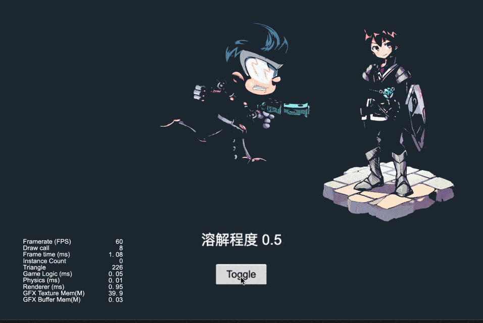

## CocosCreatorShader
### Purpose
CocosCreatorShader intends to help users who do not know Shader quickly understand how to use Cocos Effect.
### Version
Cocos Creator v3.5.x

### 2D
| NO1 | Type1 | Proj1 | NO2 | Type2 | Proj2 | NO3 | Type3 | Proj3 |
| :---: | :---: | :---: | :---: | :---: | :---: | :---: | :---: | :---: |
| 1 | 2D | [图片闪光](#spriteflashlight) | 2 | 2D | [受击闪白](#hitwhite) | 3 | 2D | [UI内发光](#glowinner) |
| 4 | 2D | [高斯模糊](#gaussianblur) | 5 | 2D | [圆形头像](#circleavatar) | 6 | 2D | [图片溶解](#spritedissolve) |
| 7 | 2D | [图片特效合集](#spritefilter) | 8 | 2D | [渐变过渡的相册](#gradualtransitionalalbum) | 9 | 2D | [马赛克](#spritemosaic) |
| 10 | 2D | [镜面光泽](#spritestreamer) | 11 | 2D | [水面波纹](#waterspread) | 12 | 2D | [灯光跟随](#followspot) |
| 13 | 2D | [融球](#metaball) | 14 | 2D | [图片消融](#spriteablation) | 15 | 2D | [2D灯光](#sprite2dlight) |
| 16 | 2D | [摸牌](#drawcard) | 17 | 2D | [按钮流光](#buttonambilight) | 18 | 2D | [彩虹](#spritedrawrainbow) |
| 19 | 2D | [动态光影](#spritedynamiclightandshadow) | 20 | 2D | [图片高亮](#spritehighlight) | 21 | 2D | [大风吹](#windblowingthrough2d) |
| 22 | 2D | [自定义头像](#spriteradiusshader) | 23 | 2D | [加载](#spriteloading) | 24 | 2D | [波浪](#spritewave) |
| 25 | 2D | [曲线波浪](#spritesinewave) | 26 | 2D | [UI内发光2](#glowinnerv2) | 27 | 2D | [加载2](#spriteloadingv2) |
| 28 | 2D | [UI外发光](#glowoutter) | 29 | 2D | [2D火焰描边](#firestroke) | 30 | 2D | [循环隧道](#looptunnel) |
| 31 | 2D | [转场动画](#transition) | 32 | 2D | [满月与星光](#moonstar) | 33 | 2D | [箭头引导线](#arrowguideline) |
| 34 | 2D | [无限滚动背景](#movingbackground) | 35 | 2D | [方形进度加载](#rectdraw) | 36 | 2D | [河面](#river) |
| 37 | 2D | [卡牌透视](#cardperspective) | 38 | 2D | [情人节](#valentineday) | 39 | 2D | [迷人的色彩](#amazingcolor) |
| 40 | 2D | [迷恋](#obsession) | 41 | 2D | [光圈](#lightcircle) | 42 | 2D | [网状光圈](#lightnet) |
| 43 | 2D | [光行](#lightrun) | 44 | 2D | [心跳](#heartbeat) | 45 | 2D | [超级马里奥](#supermario) |
| 46 | 2D | [旋转的圆点](#swirlingdots) | 47 | 2D | [变形花](#deformflower) | 48 | 2D | [星空](#starbackground) |
| 49 | 2D | [草地](#grassy) | 50 | 2D | [空间传送门](#glowcircle) | 51 | 2D | [形状调整](#tweaked) |
| 52 | 2D | [ShaderBook特效](#shaderbook) | 53 | 2D | [下雨](#rain) | 54 | 2D | [蓝天白云](#cloud) |
| 55 | 2D | [微笑](#smile) | 56 | 2D | [Emoji风格微笑](#emojismile) | 57 | 2D | [三叶草](#clover) |
| 58 | 2D | [色环](#colorcircle) | 59 | 2D | [头像边缘流光](#headframe) | 60 | 2D | [文字边缘](#outeredgeoftext) |
| 61 | 2D | [八角形](#octagrams) | 62 | 2D | [分形树](#fractaltrees) | 63 | 2D | [等离子球](#plasmaglobe) |
| 64 | 2D | [星巢](#starnest) | 65 | 2D | [风格化fuji](#cyberfuji) | 66 | 2D | [复古的太阳](#retrosun) |

### 3D
| NO1 | Type1 | Proj1 | NO2 | Type2 | Proj2 | NO3 | Type3 | Proj3 |
| :---: | :---: | :---: | :---: | :---: | :---: | :---: | :---: | :---: |
| 1 | 3D | [人物护盾](#roleshield) | 2 | 3D | [模型高亮](#rolehighlight) | 3 | 3D | [模型遮挡透视](#occlusionperspective) |
| 4 | 3D | [LowPoly风格水面](#lowpolywater) | 5 | 3D | [噪声水面](#noisewater) | 6 | 3D | [模型内发光](#modelinnerglow) |
| 7 | 3D | [模型描边](#modeloutline) | 8 | 3D | [模型消融](#modeldissolve) | 9 | 3D | [云海](#seaofclouds) |
| 10 | 3D | [模型擦除](#modelerase) | 11 | 3D | [UV动画](#uvanimation) | 12 | 3D | [UV动画混合](#uvanimationblend) |
| 13 | 3D | [UV动画扰动](#uvanimationdistortion) | 14 | 3D | [UV动画移动扰动](#uvanimationmovedistortion) | 15 | 3D | [模型扰动](#modeldistortion) |
| 16 | 3D | [模型特效](#modeleffect) | 17 | 3D | [3D导航线](#guideline) | 18 | 3D | [模型透视](#modelperspective) |

## Examples
### SpriteFlashLight
| 编号 | 类目 | 项目 | 编辑器版本 | 返回顶部 | 备注 |
| :---: | :---: | :---: | :---: | :---: | :---: |
| 1.1 | 2D | [图片流光](https://gitee.com/yeshao2069/cocos-creator-shader/tree/v3.5.x/demo/2d/Creator3.5.0_2D_Sprite_FlashLight)  | 3.5.0 | [返回顶部](#2d) | 无 |

### HitWhite
| 编号 | 类目 | 项目 | 编辑器版本 | 返回顶部 | 备注 |
| :---: | :---: | :---: | :---: | :---: | :---: |
| 1.2 | 2D | [受击闪白](https://gitee.com/yeshao2069/cocos-creator-shader/tree/v3.5.x/demo/2d/Creator3.5.0_2D_HitWhite)  | 3.5.0 | [返回顶部](#2d) | 无 |

### GlowInner
| 编号 | 类目 | 项目 | 编辑器版本 | 返回顶部 | 备注 |
| :---: | :---: | :---: | :---: | :---: | :---: |
| 1.3 | 2D | [UI内发光](https://gitee.com/yeshao2069/cocos-creator-shader/tree/v3.5.x/demo/2d/Creator3.5.0_2D_Sprite_GlowInner) | 3.5.0 | [返回顶部](#2d) | 无 |

### GaussianBlur
| 编号 | 类目 | 项目 | 编辑器版本 | 返回顶部 | 备注 |
| :---: | :---: | :---: | :---: | :---: | :---: |
| 1.4 | 2D | [高斯模糊](https://gitee.com/yeshao2069/cocos-creator-shader/tree/v3.5.x/demo/2d/Creator3.5.0_2D_Sprite_GaussianBlur)  | 3.5.0 | [返回顶部](#2d) | 无 |

### CircleAvatar
| 编号 | 类目 | 项目 | 编辑器版本 | 返回顶部 | 备注 |
| :---: | :---: | :---: | :---: | :---: | :---: |
| 1.5 | 2D | [圆形头像](https://gitee.com/yeshao2069/cocos-creator-shader/tree/v3.5.x/demo/2d/Creator3.5.2_2D_Sprite_CircleAvatar)  | 3.5.2 | [返回顶部](#2d) | 无 |

### SpriteDissolve
| 编号 | 类目 | 项目 | 编辑器版本 | 返回顶部 | 备注 |
| :---: | :---: | :---: | :---: | :---: | :---: |
| 1.6 | 2D | [图片溶解](https://gitee.com/yeshao2069/cocos-creator-shader/tree/v3.5.x/demo/2d/Creator3.5.2_2D_Sprite_Dissolve)  | 3.5.2 | [返回顶部](#2d) | 无 |

### SpriteFilter
| 编号 | 类目 | 项目 | 编辑器版本 | 返回顶部 | 备注 |
| :---: | :---: | :---: | :---: | :---: | :---: |
| 1.7 | 2D | [图片特效合集](https://gitee.com/yeshao2069/cocos-creator-shader/tree/v3.5.x/demo/2d/Creator3.5.2_2D_Sprite_Filter)  | 3.5.2 | [返回顶部](#2d) | 无 |

### GradualTransitionalAlbum
| 编号 | 类目 | 项目 | 编辑器版本 | 返回顶部 | 备注 |
| :---: | :---: | :---: | :---: | :---: | :---: |
| 1.8 | 2D | [渐变过渡的相册](https://gitee.com/yeshao2069/cocos-creator-shader/tree/v3.5.x/demo/2d/Creator3.5.0_2D_Sprite_GradualTransitionalAlbum)  | 3.5.0 | [返回顶部](#2d) | 无 |

### SpriteMosaic
| 编号 | 类目 | 项目 | 编辑器版本 | 返回顶部 | 备注 |
| :---: | :---: | :---: | :---: | :---: | :---: |
| 1.9 | 2D | [马赛克](https://gitee.com/yeshao2069/cocos-creator-shader/tree/v3.5.x/demo/2d/Creator3.5.0_2D_Sprite_Mosaic)  | 3.5.0 | [返回顶部](#2d) | 无 |

### SpriteStreamer
| 编号 | 类目 | 项目 | 编辑器版本 | 返回顶部 | 备注 |
| :---: | :---: | :---: | :---: | :---: | :---: |
| 1.10 | 2D | [镜面光泽](https://gitee.com/yeshao2069/cocos-creator-shader/tree/v3.5.x/demo/2d/Creator3.5.0_2D_Sprite_Streamer)  | 3.5.0 | [返回顶部](#2d) | 无 |

### WaterSpread
| 编号 | 类目 | 项目 | 编辑器版本 | 返回顶部 | 备注 |
| :---: | :---: | :---: | :---: | :---: | :---: |
| 1.11 | 2D | [水面波纹](https://gitee.com/yeshao2069/cocos-creator-shader/tree/v3.5.x/demo/2d/Creator3.5.0_2D_Sprite_WaterSpread)  | 3.5.0 | [返回顶部](#2d) | 无 |

### FollowSpot
| 编号 | 类目 | 项目 | 编辑器版本 | 返回顶部 | 备注 |
| :---: | :---: | :---: | :---: | :---: | :---: |
| 1.12 | 2D | [灯光跟随](https://gitee.com/yeshao2069/cocos-creator-shader/tree/v3.5.x/demo/2d/Creator3.5.0_2D_Sprite_FollowSpot)  | 3.5.0 | [返回顶部](#2d) | 无 |

### Metaball
| 编号 | 类目 | 项目 | 编辑器版本 | 返回顶部 | 备注 |
| :---: | :---: | :---: | :---: | :---: | :---: |
| 1.13 | 2D | [融球](https://gitee.com/yeshao2069/cocos-creator-shader/tree/v3.5.x/demo/2d/Creator3.5.0_2D_Sprite_Metaball)  | 3.5.0 | [返回顶部](#2d) | 无 |

### SpriteAblation
| 编号 | 类目 | 项目 | 编辑器版本 | 返回顶部 | 备注 |
| :---: | :---: | :---: | :---: | :---: | :---: |
| 1.14 | 2D | [图片消融](https://gitee.com/yeshao2069/cocos-creator-shader/tree/v3.5.x/demo/2d/Creator3.5.2_2D_Sprite_Ablation)  | 3.5.2 | [返回顶部](#2d) | 无 |

### Sprite2DLight
| 编号 | 类目 | 项目 | 编辑器版本 | 返回顶部 | 备注 |
| :---: | :---: | :---: | :---: | :---: | :---: |
| 1.15 | 2D | [2D灯光](https://gitee.com/yeshao2069/cocos-creator-shader/tree/v3.5.x/demo/2d/Creator3.5.0_2D_Sprite_Light)  | 3.5.0 | [返回顶部](#2d) | 无 |

### DrawCard
| 编号 | 类目 | 项目 | 编辑器版本 | 返回顶部 | 备注 |
| :---: | :---: | :---: | :---: | :---: | :---: |
| 1.16 | 2D | [摸牌](https://gitee.com/yeshao2069/cocos-creator-shader/tree/v3.5.x/demo/2d/Creator3.5.0_2D_Sprite_DrawCard)  | 3.5.0 | [返回顶部](#2d) | 无 |

### ButtonAmbilight
| 编号 | 类目 | 项目 | 编辑器版本 | 返回顶部 | 备注 |
| :---: | :---: | :---: | :---: | :---: | :---: |
| 1.17 | 2D | [按钮流光](https://gitee.com/yeshao2069/cocos-creator-shader/tree/v3.5.x/demo/2d/Creator3.5.0_2D_Sprite_ButtonAmbilight)  | 3.5.0 | [返回顶部](#2d) | 无 |

### SpriteDrawRainbow
| 编号 | 类目 | 项目 | 编辑器版本 | 返回顶部 | 备注 |
| :---: | :---: | :---: | :---: | :---: | :---: |
| 1.18 | 2D | [彩虹](https://gitee.com/yeshao2069/cocos-creator-shader/tree/v3.5.x/demo/2d/Creator3.5.0_2D_Sprite_DrawRainbow)  | 3.5.0 | [返回顶部](#2d) | 无 |

### SpriteDynamicLightAndShadow
| 编号 | 类目 | 项目 | 编辑器版本 | 返回顶部 | 备注 |
| :---: | :---: | :---: | :---: | :---: | :---: |
| 1.19 | 2D | [动态光影](https://gitee.com/yeshao2069/cocos-creator-shader/tree/v3.5.x/demo/2d/Creator3.5.0_2D_Sprite_DynamicLightAndShadow)  | 3.5.0 | [返回顶部](#2d) | 无 |

### SpriteHighLight
| 编号 | 类目 | 项目 | 编辑器版本 | 返回顶部 | 备注 |
| :---: | :---: | :---: | :---: | :---: | :---: |
| 1.20 | 2D | [图片高亮](https://gitee.com/yeshao2069/cocos-creator-shader/tree/v3.5.x/demo/2d/Creator3.5.0_2D_Sprite_HighLight)  | 3.5.0 | [返回顶部](#2d) | 无 |

### WindBlowingThrough2D
| 编号 | 类目 | 项目 | 编辑器版本 | 返回顶部 | 备注 |
| :---: | :---: | :---: | :---: | :---: | :---: |
| 1.21 | 2D | [植物受风摆动](https://gitee.com/yeshao2069/cocos-creator-shader/tree/v3.5.x/demo/2d/Creator3.5.0_2D_Sprite_WindBlowing)  | 3.5.0 | [返回顶部](#2d) | 无 |

### SpriteRadiusShader
| 编号 | 类目 | 项目 | 编辑器版本 | 返回顶部 | 备注 |
| :---: | :---: | :---: | :---: | :---: | :---: |
| 1.22 | 2D | [自定义头像](https://gitee.com/yeshao2069/cocos-creator-shader/tree/v3.5.x/demo/2d/Creator3.5.0_2D_Sprite_CustomizedAvatar)  | 3.5.0 | [返回顶部](#2d) | 无 |

### SpriteLoading
| 编号 | 类目 | 项目 | 编辑器版本 | 返回顶部 | 备注 |
| :---: | :---: | :---: | :---: | :---: | :---: |
| 1.23 | 2D | [加载](https://gitee.com/yeshao2069/cocos-creator-shader/tree/v3.5.x/demo/2d/Creator3.5.0_2D_Sprite_Loading)  | 3.5.0 | [返回顶部](#2d) | 无 |

### SpriteWave
| 编号 | 类目 | 项目 | 编辑器版本 | 返回顶部 | 备注 |
| :---: | :---: | :---: | :---: | :---: | :---: |
| 1.24 | 2D | [波浪](https://gitee.com/yeshao2069/cocos-creator-shader/tree/v3.5.x/demo/2d/Creator3.5.0_2D_Sprite_Wave)  | 3.5.0 | [返回顶部](#2d) | 无 |

### SpriteSineWave
| 编号 | 类目 | 项目 | 编辑器版本 | 返回顶部 | 备注 |
| :---: | :---: | :---: | :---: | :---: | :---: |
| 1.25 | 2D | [曲线波浪](https://gitee.com/yeshao2069/cocos-creator-shader/tree/v3.5.x/demo/2d/Creator3.5.0_2D_Sprite_SineWave)  | 3.5.0 | [返回顶部](#2d) | 无 |

### GlowInnerV2
| 编号 | 类目 | 项目 | 编辑器版本 | 返回顶部 | 备注 |
| :---: | :---: | :---: | :---: | :---: | :---: |
| 1.26 | 2D | [UI内发光2](https://gitee.com/yeshao2069/cocos-creator-shader/tree/v3.5.x/demo/2d/Creator3.5.0_2D_Sprite_GlowInnerv2) | 3.5.0 | [返回顶部](#2d) | 无 |

### SpriteLoadingV2
| 编号 | 类目 | 项目 | 编辑器版本 | 返回顶部 | 备注 |
| :---: | :---: | :---: | :---: | :---: | :---: |
| 1.27 | 2D | [加载2](https://gitee.com/yeshao2069/cocos-creator-shader/tree/v3.5.x/demo/2d/Creator3.5.0_2D_Sprite_LoadingStyle) | 3.5.0 | [返回顶部](#2d) | 无 |

### GlowOutter
| 编号 | 类目 | 项目 | 编辑器版本 | 返回顶部 | 备注 |
| :---: | :---: | :---: | :---: | :---: | :---: |
| 1.28 | 2D | [UI外发光](https://gitee.com/yeshao2069/cocos-creator-shader/tree/v3.5.x/demo/2d/Creator3.5.0_2D_Sprite_GlowOutter) | 3.5.0 | [返回顶部](#2d) | 无 |

### FireStroke
| 编号 | 类目 | 项目 | 编辑器版本 | 返回顶部 | 备注 |
| :---: | :---: | :---: | :---: | :---: | :---: |
| 1.29 | 2D | [2D人物火焰描边](https://gitee.com/yeshao2069/cocos-creator-shader/tree/v3.5.x/demo/2d/Creator3.5.1_2D_SpriteFireStroke) | 3.5.1 | [返回顶部](#2d) | 无 |

### LoopTunnel
| 编号 | 类目 | 项目 | 编辑器版本 | 返回顶部 | 备注 |
| :---: | :---: | :---: | :---: | :---: | :---: |
| 1.30 | 2D | [循环隧道](https://gitee.com/yeshao2069/cocos-creator-shader/tree/v3.5.x/demo/2d/Creator3.5.1_2D_LoopTunnel) | 3.5.1 | [返回顶部](#2d) | 无 |

### RoleShield
| 编号 | 类目 | 项目 | 编辑器版本 | 返回顶部 | 备注 |
| :---: | :---: | :---: | :---: | :---: | :---: |
| 2.1 | 3D | [人物护盾](https://gitee.com/yeshao2069/cocos-creator-shader/tree/v3.5.x/demo/3d/Creator3.5.0_3D_RoleShield)  | 3.5.0 | [返回顶部](#3d) | 无 |

### RoleHighLight
| 编号 | 类目 | 项目 | 编辑器版本 | 返回顶部 | 备注 |
| :---: | :---: | :---: | :---: | :---: | :---: |
| 2.2 | 3D | [模型高亮](https://gitee.com/yeshao2069/cocos-creator-shader/tree/v3.5.x/demo/3d/Creator3.5.2_3D_ModelHighLight)  | 3.5.2 | [返回顶部](#3d) | 无 |

### OcclusionPerspective
| 编号 | 类目 | 项目 | 编辑器版本 | 返回顶部 | 备注 |
| :---: | :---: | :---: | :---: | :---: | :---: |
| 2.3 | 3D | [模型遮挡透视](https://gitee.com/yeshao2069/cocos-creator-shader/tree/v3.5.x/demo/3d/Creator3.5.0_3D_ModelOcclusionPerspective)  | 3.5.0 | [返回顶部](#3d) | 无 |

### LowPolyWater
| 编号 | 类目 | 项目 | 编辑器版本 | 返回顶部 | 备注 |
| :---: | :---: | :---: | :---: | :---: | :---: |
| 2.4 | 3D | [LowPoly风格水面](https://gitee.com/yeshao2069/cocos-creator-shader/tree/v3.5.x/demo/3d/Creator3.5.2_3D_LowPolyStyleWater) | 3.5.2 | [返回顶部](#3d) | 无 |

### NoiseWater
| 编号 | 类目 | 项目 | 编辑器版本 | 返回顶部 | 备注 |
| :---: | :---: | :---: | :---: | :---: | :---: |
| 2.5 | 3D | [噪声水面](https://gitee.com/yeshao2069/cocos-creator-shader/tree/v3.5.x/demo/3d/Creator3.5.2_3D_NoiseWater) | 3.5.2 | [返回顶部](#3d) | 无 |

### ModelInnerGlow
| 编号 | 类目 | 项目 | 编辑器版本 | 返回顶部 | 备注 |
| :---: | :---: | :---: | :---: | :---: | :---: |
| 2.6 | 3D | [模型内发光](https://gitee.com/yeshao2069/cocos-creator-shader/tree/v3.5.x/demo/3d/Creator3.5.1_3D_ModelInnerGlow) | 3.5.1 | [返回顶部](#3d) | 需为胶囊体 |

### ModelOutline
| 编号 | 类目 | 项目 | 编辑器版本 | 返回顶部 | 备注 |
| :---: | :---: | :---: | :---: | :---: | :---: |
| 2.7 | 3D | [模型描边](https://gitee.com/yeshao2069/cocos-creator-shader/tree/v3.5.x/demo/3d/Creator3.5.1_3D_ModelOutline) | 3.5.1 | [返回顶部](#3d) | 需为胶囊体 |

### ModelDissolve
| 编号 | 类目 | 项目 | 编辑器版本 | 返回顶部 | 备注 |
| :---: | :---: | :---: | :---: | :---: | :---: |
| 2.8 | 3D | [模型消融](https://gitee.com/yeshao2069/cocos-creator-shader/tree/v3.5.x/demo/3d/Creator3.5.2_3D_ModelDissolve) | 3.5.2 | [返回顶部](#3d) | 无 |

### SeaOfClouds
| 编号 | 类目 | 项目 | 编辑器版本 | 返回顶部 | 备注 |
| :---: | :---: | :---: | :---: | :---: | :---: |
| 2.9 | 3D | [云海](https://gitee.com/yeshao2069/cocos-creator-shader/tree/v3.5.x/demo/3d/Creator3.5.1_3D_SeaOfClouds) | 3.5.1 | [返回顶部](#3d) | 无 |

### ModelErase
| 编号 | 类目 | 项目 | 编辑器版本 | 返回顶部 | 备注 |
| :---: | :---: | :---: | :---: | :---: | :---: |
| 2.10 | 3D | [模型擦除](https://gitee.com/yeshao2069/cocos-creator-shader/tree/v3.5.x/demo/3d/Creator3.5.2_3D_ModelErase) | 3.5.2 | [返回顶部](#3d) | 无 |

### UVAnimation
| 编号 | 类目 | 项目 | 编辑器版本 | 返回顶部 | 备注 |
| :---: | :---: | :---: | :---: | :---: | :---: |
| 2.11 | 3D | [UV动画](https://gitee.com/yeshao2069/cocos-creator-shader/tree/v3.5.x/demo/3d/Creator3.5.2_3D_uvAnimation) | 3.5.2 | [返回顶部](#3d) | 无 |

### UVAnimationBlend
| 编号 | 类目 | 项目 | 编辑器版本 | 返回顶部 | 备注 |
| :---: | :---: | :---: | :---: | :---: | :---: |
| 2.12 | 3D | [UV动画混合](https://gitee.com/yeshao2069/cocos-creator-shader/tree/v3.5.x/demo/3d/Creator3.5.2_3D_uvAnimationBlend) | 3.5.2 | [返回顶部](#3d) | 无 |

### UVAnimationDistortion
| 编号 | 类目 | 项目 | 编辑器版本 | 返回顶部 | 备注 |
| :---: | :---: | :---: | :---: | :---: | :---: |
| 2.13 | 3D | [UV动画扰动](https://gitee.com/yeshao2069/cocos-creator-shader/tree/v3.5.x/demo/3d/Creator3.5.2_3D_uvAnimationDistortion) | 3.5.2 | [返回顶部](#3d) | 无 |

### UVAnimationMoveDistortion
| 编号 | 类目 | 项目 | 编辑器版本 | 返回顶部 | 备注 |
| :---: | :---: | :---: | :---: | :---: | :---: |
| 2.14 | 3D | [UV动画移动扰动](https://gitee.com/yeshao2069/cocos-creator-shader/tree/v3.5.x/demo/3d/Creator3.5.2_3D_uvAnimationMoveDistortion) | 3.5.2 | [返回顶部](#3d) | 无 |

### ModelDistortion
| 编号 | 类目 | 项目 | 编辑器版本 | 返回顶部 | 备注 |
| :---: | :---: | :---: | :---: | :---: | :---: |
| 2.15 | 3D | [模型扰动](https://gitee.com/yeshao2069/cocos-creator-shader/tree/v3.5.x/demo/3d/Creator3.5.2_3D_ModelDistortion) | 3.5.2 | [返回顶部](#3d) | 无 |

### ModelEffect
| 编号 | 类目 | 项目 | 编辑器版本 | 返回顶部 | 备注 |
| :---: | :---: | :---: | :---: | :---: | :---: |
| 2.16 | 3D | [模型特效](https://gitee.com/yeshao2069/cocos-creator-shader/tree/v3.5.x/demo/3d/Creator3.5.2_3D_ModelEffect) | 3.5.2 | [返回顶部](#3d) | 无 |

### GuideLine
| 编号 | 类目 | 项目 | 编辑器版本 | 返回顶部 | 备注 |
| :---: | :---: | :---: | :---: | :---: | :---: |
| 2.17 | 3D | [3D导航线](https://gitee.com/yeshao2069/cocos-creator-shader/tree/v3.5.x/demo/3d/Creator3.5.2_3D_GuideLine) | 3.5.2 | [返回顶部](#3d) | 无 |

### ModelPerspective
| 编号 | 类目 | 项目 | 编辑器版本 | 返回顶部 | 备注 |
| :---: | :---: | :---: | :---: | :---: | :---: |
| 2.18 | 3D | [模型透视](https://gitee.com/yeshao2069/cocos-creator-shader/tree/v3.5.x/demo/3d/Creator3.5.2_3D_ModelPerspective) | 3.5.2 | [返回顶部](#3d) | 无 |

### Transition
| 编号 | 类目 | 项目 | 编辑器版本 | 返回顶部 | 备注 |
| :---: | :---: | :---: | :---: | :---: | :---: |
| 3.1 | 2D | [转场动画](https://gitee.com/yeshao2069/cocos-creator-shader/tree/v3.5.x/demo/2dP1/Creator3.5.2_2D_Transition) | 3.5.2 | [返回顶部](#2d) | 无 |

### MoonStar
| 编号 | 类目 | 项目 | 编辑器版本 | 返回顶部 | 备注 |
| :---: | :---: | :---: | :---: | :---: | :---: |
| 3.2 | 2D | [满月与星光](https://gitee.com/yeshao2069/cocos-creator-shader/tree/v3.5.x/demo/2dP1/Creator3.5.1_2D_Moon) | 3.5.1 | [返回顶部](#2d) | 无 |

### ArrowGuideLine
| 编号 | 类目 | 项目 | 编辑器版本 | 返回顶部 | 备注 |
| :---: | :---: | :---: | :---: | :---: | :---: |
| 3.3 | 2D | [箭头引导线](https://gitee.com/yeshao2069/cocos-creator-shader/tree/v3.5.x/demo/2dP1/Creator3.5.1_2D_ArrowGuideLine) | 3.5.1 | [返回顶部](#2d) | 无 |

### MovingBackground
| 编号 | 类目 | 项目 | 编辑器版本 | 返回顶部 | 备注 |
| :---: | :---: | :---: | :---: | :---: | :---: |
| 3.4 | 2D | [无限滚动背景](https://gitee.com/yeshao2069/cocos-creator-shader/tree/v3.5.x/demo/2dP1/Creator3.5.2_2D_MovingBackground) | 3.5.2 | [返回顶部](#2d) | 无 |

### RectDraw
| 编号 | 类目 | 项目 | 编辑器版本 | 返回顶部 | 备注 |
| :---: | :---: | :---: | :---: | :---: | :---: |
| 3.5 | 2D | [方形进度加载](https://gitee.com/yeshao2069/cocos-creator-shader/tree/v3.5.x/demo/2dP1/Creator3.5.2_2D_RectDraw) | 3.5.2 | [返回顶部](#2d) | 无 |

### River
| 编号 | 类目 | 项目 | 编辑器版本 | 返回顶部 | 备注 |
| :---: | :---: | :---: | :---: | :---: | :---: |
| 3.6 | 2D | [河面](https://gitee.com/yeshao2069/cocos-creator-shader/tree/v3.5.x/demo/2dP1/Creator3.5.2_2D_River) | 3.5.2 | [返回顶部](#2d) | 无 |

### CardPerspective
| 编号 | 类目 | 项目 | 编辑器版本 | 返回顶部 | 备注 |
| :---: | :---: | :---: | :---: | :---: | :---: |
| 3.7 | 2D | [卡牌透视](https://gitee.com/yeshao2069/cocos-creator-shader/tree/v3.5.x/demo/2dP1/Creator3.5.2_2D_CardPerspective) | 3.5.2 | [返回顶部](#2d) | 无 |

### ValentineDay
| 编号 | 类目 | 项目 | 编辑器版本 | 返回顶部 | 备注 |
| :---: | :---: | :---: | :---: | :---: | :---: |
| 3.8 | 2D | [情人节](https://gitee.com/yeshao2069/cocos-creator-shader/tree/v3.5.x/demo/2dP1/Creator3.5.2_2D_ValentineDay) | 3.5.2 | [返回顶部](#2d) | mac 12.4 Chrome FPS: 4 |

### AmazingColor
| 编号 | 类目 | 项目 | 编辑器版本 | 返回顶部 | 备注 |
| :---: | :---: | :---: | :---: | :---: | :---: |
| 3.9 | 2D | [迷人的色彩](https://gitee.com/yeshao2069/cocos-creator-shader/tree/v3.5.x/demo/2dP1/Creator3.5.2_2D_AmazingColor) | 3.5.2 | [返回顶部](#2d) | 无 |

### Obsession
| 编号 | 类目 | 项目 | 编辑器版本 | 返回顶部 | 备注 |
| :---: | :---: | :---: | :---: | :---: | :---: |
| 3.10 | 2D | [迷恋](https://gitee.com/yeshao2069/cocos-creator-shader/tree/v3.5.x/demo/2dP1/Creator3.5.2_2D_Obsession) | 3.5.2 | [返回顶部](#2d) | 无 |

### LightCircle
| 编号 | 类目 | 项目 | 编辑器版本 | 返回顶部 | 备注 |
| :---: | :---: | :---: | :---: | :---: | :---: |
| 3.11 | 2D | [光圈](https://gitee.com/yeshao2069/cocos-creator-shader/tree/v3.5.x/demo/2dP1/Creator3.5.2_2D_LightCircle) | 3.5.2 | [返回顶部](#2d) | 无 |

### LightNet
| 编号 | 类目 | 项目 | 编辑器版本 | 返回顶部 | 备注 |
| :---: | :---: | :---: | :---: | :---: | :---: |
| 3.12 | 2D | [网状光圈](https://gitee.com/yeshao2069/cocos-creator-shader/tree/v3.5.x/demo/2dP1/Creator3.5.2_2D_LightNet) | 3.5.2 | [返回顶部](#2d) | 无 |

### LightRun
| 编号 | 类目 | 项目 | 编辑器版本 | 返回顶部 | 备注 |
| :---: | :---: | :---: | :---: | :---: | :---: |
| 3.13 | 2D | [光行](https://gitee.com/yeshao2069/cocos-creator-shader/tree/v3.5.x/demo/2dP1/Creator3.5.2_2D_LightRun) | 3.5.2 | [返回顶部](#2d) | 无 |

### HeartBeat
| 编号 | 类目 | 项目 | 编辑器版本 | 返回顶部 | 备注 |
| :---: | :---: | :---: | :---: | :---: | :---: |
| 3.14 | 2D | [心跳](https://gitee.com/yeshao2069/cocos-creator-shader/tree/v3.5.x/demo/2dP1/Creator3.5.2_2D_HeartBeat) | 3.5.2 | [返回顶部](#2d) | 无 |

### SuperMario
| 编号 | 类目 | 项目 | 编辑器版本 | 返回顶部 | 备注 |
| :---: | :---: | :---: | :---: | :---: | :---: |
| 3.15 | 2D | [超级马里奥](https://gitee.com/yeshao2069/cocos-creator-shader/tree/v3.5.x/demo/2dP1/Creator3.5.2_2D_SuperMario) | 3.5.2 | [返回顶部](#2d) | 无 |

### SwirlingDots
| 编号 | 类目 | 项目 | 编辑器版本 | 返回顶部 | 备注 |
| :---: | :---: | :---: | :---: | :---: | :---: |
| 3.16 | 2D | [旋转的圆点](https://gitee.com/yeshao2069/cocos-creator-shader/tree/v3.5.x/demo/2dP1/Creator3.5.2_2D_SwirlingDots) | 3.5.2 | [返回顶部](#2d) | 无 |

### DeformFlower
| 编号 | 类目 | 项目 | 编辑器版本 | 返回顶部 | 备注 |
| :---: | :---: | :---: | :---: | :---: | :---: |
| 3.17 | 2D | [变形花](https://gitee.com/yeshao2069/cocos-creator-shader/tree/v3.5.x/demo/2dP1/Creator3.5.2_2D_DeformFlower) | 3.5.2 | [返回顶部](#2d) | 无 |

### StarBackground
| 编号 | 类目 | 项目 | 编辑器版本 | 返回顶部 | 备注 |
| :---: | :---: | :---: | :---: | :---: | :---: |
| 3.18 | 2D | [星空](https://gitee.com/yeshao2069/cocos-creator-shader/tree/v3.5.x/demo/2dP1/Creator3.5.2_2D_StarBackground) | 3.5.2 | [返回顶部](#2d) | 无 |

### Grassy
| 编号 | 类目 | 项目 | 编辑器版本 | 返回顶部 | 备注 |
| :---: | :---: | :---: | :---: | :---: | :---: |
| 3.19 | 2D | [草地](https://gitee.com/yeshao2069/cocos-creator-shader/tree/v3.5.x/demo/2dP1/Creator3.5.2_2D_Grassy) | 3.5.2 | [返回顶部](#2d) | 无 |

### GlowCircle
| 编号 | 类目 | 项目 | 编辑器版本 | 返回顶部 | 备注 |
| :---: | :---: | :---: | :---: | :---: | :---: |
| 3.20 | 2D | [空间传送门](https://gitee.com/yeshao2069/cocos-creator-shader/tree/v3.5.x/demo/2dP1/Creator3.5.2_2D_GlowCircle) | 3.5.2 | [返回顶部](#2d) | 无 |

### Tweaked
| 编号 | 类目 | 项目 | 编辑器版本 | 返回顶部 | 备注 |
| :---: | :---: | :---: | :---: | :---: | :---: |
| 3.21 | 2D | [形状调整](https://gitee.com/yeshao2069/cocos-creator-shader/tree/v3.5.x/demo/2dP1/Creator3.5.2_2D_Tweaked) | 3.5.2 | [返回顶部](#2d) | 无 |

### ShaderBook
| 编号 | 类目 | 项目 | 编辑器版本 | 返回顶部 | 备注 |
| :---: | :---: | :---: | :---: | :---: | :---: |
| 3.22 | 2D | [ShaderBook特效](https://gitee.com/yeshao2069/cocos-creator-shader/tree/v3.5.x/demo/2dP1/Creator3.5.2_2D_TheBookOfShaders) | 3.5.2 | [返回顶部](#2d) | 包含 26 种基础特效 |

### Rain
| 编号 | 类目 | 项目 | 编辑器版本 | 返回顶部 | 备注 |
| :---: | :---: | :---: | :---: | :---: | :---: |
| 3.23 | 2D | [下雨](https://gitee.com/yeshao2069/cocos-creator-shader/tree/v3.5.x/demo/2dP1/Creator3.5.2_2D_Rain) | 3.5.2 | [返回顶部](#2d) | 无 |

### Cloud
| 编号 | 类目 | 项目 | 编辑器版本 | 返回顶部 | 备注 |
| :---: | :---: | :---: | :---: | :---: | :---: |
| 3.24 | 2D | [蓝天白云](https://gitee.com/yeshao2069/cocos-creator-shader/tree/v3.5.x/demo/2dP1/Creator3.5.2_2D_Clouds) | 3.5.2 | [返回顶部](#2d) | 无 |

### Smile
| 编号 | 类目 | 项目 | 编辑器版本 | 返回顶部 | 备注 |
| :---: | :---: | :---: | :---: | :---: | :---: |
| 3.25 | 2D | [微笑](https://gitee.com/yeshao2069/cocos-creator-shader/tree/v3.5.x/demo/2dP1/Creator3.5.2_2D_Smile) | 3.5.2 | [返回顶部](#2d) | 无 |

### EmojiSmile
| 编号 | 类目 | 项目 | 编辑器版本 | 返回顶部 | 备注 |
| :---: | :---: | :---: | :---: | :---: | :---: |
| 3.26 | 2D | [Emoji风格微笑](https://gitee.com/yeshao2069/cocos-creator-shader/tree/v3.5.x/demo/2dP1/Creator3.5.2_2D_EmojiSmile) | 3.5.2 | [返回顶部](#2d) | 无 |

### Clover
| 编号 | 类目 | 项目 | 编辑器版本 | 返回顶部 | 备注 |
| :---: | :---: | :---: | :---: | :---: | :---: |
| 3.27 | 2D | [三叶草](https://gitee.com/yeshao2069/cocos-creator-shader/tree/v3.5.x/demo/2dP1/Creator3.5.2_2D_Clover) | 3.5.2 | [返回顶部](#2d) | 无 |

### ColorCircle
| 编号 | 类目 | 项目 | 编辑器版本 | 返回顶部 | 备注 |
| :---: | :---: | :---: | :---: | :---: | :---: |
| 3.28 | 2D | [色环](https://gitee.com/yeshao2069/cocos-creator-shader/tree/v3.5.x/demo/2dP1/Creator3.5.2_2D_ColorCircle) | 3.5.2 | [返回顶部](#2d) | 无 |

### HeadFrame
| 编号 | 类目 | 项目 | 编辑器版本 | 返回顶部 | 备注 |
| :---: | :---: | :---: | :---: | :---: | :---: |
| 3.29 | 2D | [头像边缘流光](https://gitee.com/yeshao2069/cocos-creator-shader/tree/v3.5.x/demo/2dP1/Creator3.5.2_2D_HeadFrame) | 3.5.2 | [返回顶部](#2d) | 无 |

### OuterEdgeOfText
| 编号 | 类目 | 项目 | 编辑器版本 | 返回顶部 | 备注 |
| :---: | :---: | :---: | :---: | :---: | :---: |
| 3.30 | 2D | [文字边缘](https://gitee.com/yeshao2069/cocos-creator-shader/tree/v3.5.x/demo/2dP1/Creator3.5.2_2D_OuterEdgeOfText) | 3.5.2 | [返回顶部](#2d) | 来源：shadertoy.com |

### Octagrams
| 编号 | 类目 | 项目 | 编辑器版本 | 返回顶部 | 备注 |
| :---: | :---: | :---: | :---: | :---: | :---: |
| 4.1 | 2D | [八角形](https://gitee.com/yeshao2069/cocos-creator-shader/tree/v3.5.x/demo/2dP2/Creator3.5.2_2D_Octagrams) | 3.5.2 | [返回顶部](#2d) | 来源：shadertoy.com |

### FractalTrees
| 编号 | 类目 | 项目 | 编辑器版本 | 返回顶部 | 备注 |
| :---: | :---: | :---: | :---: | :---: | :---: |
| 4.2 | 2D | [分形树](https://gitee.com/yeshao2069/cocos-creator-shader/tree/v3.5.x/demo/2dP2/Creator3.5.2_2D_FractalTrees) | 3.5.2 | [返回顶部](#2d) | 来源：shadertoy.com |

### PlasmaGlobe
| 编号 | 类目 | 项目 | 编辑器版本 | 返回顶部 | 备注 |
| :---: | :---: | :---: | :---: | :---: | :---: |
| 4.3 | 2D | [等离子球](https://gitee.com/yeshao2069/cocos-creator-shader/tree/v3.5.x/demo/2dP2/Creator3.5.2_2D_PlasmaGlobe) | 3.5.2 | [返回顶部](#2d) | 来源：shadertoy.com |

### StarNest
| 编号 | 类目 | 项目 | 编辑器版本 | 返回顶部 | 备注 |
| :---: | :---: | :---: | :---: | :---: | :---: |
| 4.4 | 2D | [星巢](https://gitee.com/yeshao2069/cocos-creator-shader/tree/v3.5.x/demo/2dP2/Creator3.5.2_2D_StarNest) | 3.5.2 | [返回顶部](#2d) | 来源：shadertoy.com |

### CyberFuji
| 编号 | 类目 | 项目 | 编辑器版本 | 返回顶部 | 备注 |
| :---: | :---: | :---: | :---: | :---: | :---: |
| 4.5 | 2D | [风格化fuji](https://gitee.com/yeshao2069/cocos-creator-shader/tree/v3.5.x/demo/2dP2/Creator3.5.2_2D_CyberFuji) | 3.5.2 | [返回顶部](#2d) | 来源：shadertoy.com |

### RetroSun
| 编号 | 类目 | 项目 | 编辑器版本 | 返回顶部 | 备注 |
| :---: | :---: | :---: | :---: | :---: | :---: |
| 4.6 | 2D | [复古的太阳](https://gitee.com/yeshao2069/cocos-creator-shader/tree/v3.5.x/demo/2dP2/Creator3.5.2_2D_RetroSun) | 3.5.2 | [返回顶部](#2d) | 来源：shadertoy.com |

