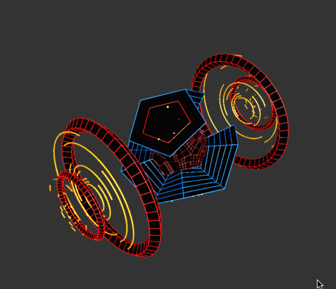
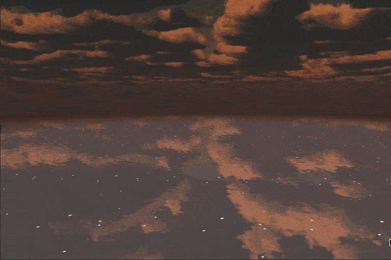
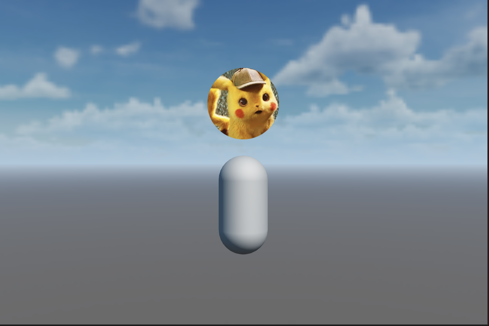

## CocosCreatorShader
### Purpose
CocosCreatorShader intends to help users who do not know Shader quickly understand how to use Cocos Effect.
### Version
Cocos Creator v3.6.x

### 2D
| NO1 | Proj1 | NO2 | Proj2 | NO3 | Proj3 | NO4 | Proj4 |
| :---: | :--- | :---: | :--- | :---: | :--- | :---: | :--- |
| 1 | [Flash Light](#flashlight) | 2 | [受击闪白](#hitwhite) | 3 | [UI内发光](#glowinner) | 4 | [高斯模糊](#gaussianblur) |
| 5 | [圆形头像](#circleavatar) | 6 | [图片溶解](#spritedissolve) | 7 | [图片特效合集](#spritefilter) | 8 | [渐变过渡的相册](#gradualtransitionalalbum) |
| 9 | [马赛克](#spritemosaic) | 10 | [镜面光泽](#spritestreamer) | 11 | [水面波纹](#waterspread) | 12 | [灯光跟随](#followspot) |
| 13 | [融球](#metaball) | 14 | [图片消融](#spriteablation) | 15 | [2D灯光](#sprite2dlight) | 16 | [摸牌](#drawcard) |
| 17 | [按钮流光](#buttonambilight) | 18 | [彩虹](#spritedrawrainbow) | 19 | [动态光影](#spritedynamiclightandshadow) | 20 | [图片高亮](#spritehighlight) |
| 21 | [大风吹](#windblowingthrough2d) | 22 | [自定义头像](#spriteradiusshader) | 23 | [加载](#spriteloading) | 24 | [波浪](#spritewave) |
| 25 | [曲线波浪](#spritesinewave) | 26 | [UI内发光2](#glowinnerv2) | 27 | [加载2](#loadingstyle) | 28 | [UI外发光](#glowoutter) |
| 29 | [2D火焰描边](#firestroke) | 30 | [循环隧道](#looptunnel) | 31 | [转场动画](#transition) | 32 | [满月与星光](#moonstar) |
| 33 | [箭头引导线](#arrowguideline) | 34 | [无限滚动背景](#movingbackground) | 35 | [方形进度加载](#rectdraw) | 36 | [河面](#river) |
| 37 | [卡牌透视](#cardperspective) | 38 | [情人节](#valentineday) | 39 | [迷人的色彩](#amazingcolor) | 40 | [迷恋](#obsession) |
| 41 | [光圈](#lightcircle) | 42 | [网状光圈](#lightnet) | 43 | [光行](#lightrun) | 44 | [心跳](#heartbeat) |
| 45 | [超级马里奥](#supermario) | 46 | [旋转的圆点](#swirlingdots) | 47 | [变形花](#deformflower) | 48 | [星空](#starbackground) |
| 49 | [草地](#grassy) | 50 | [空间传送门](#glowcircle) | 51 | [形状调整](#tweaked) | 52 | [ShaderBook特效](#shaderbook) |
| 53 | [下雨](#rain) | 54 | [蓝天白云](#cloud) | 55 | [微笑](#smile) | 56 | [Emoji风格微笑](#emojismile) |
| 57 | [三叶草](#clover) | 58 | [色环](#colorcircle) | 59 | [头像边缘流光](#headframe) | 60 | [文字边缘](#outeredgeoftext) |
| 61 | [八角形](#octagrams) | 62 | [分形树](#fractaltrees) | 63 | [等离子球](#plasmaglobe) | 64 | [星巢](#starnest) |
| 65 | [风格化fuji](#cyberfuji) | 66 | [复古的太阳](#retrosun) | 67 | [流失](#downthedrain) | 68 | [寰宇之内](#universewithin) |
| 69 | [图片渐变](#spritegradient) | 70 | [图片阴影](#spriteshadow) | 71 | [卷轴展开和收拢](#reelunfoldingandclosing) | 72 | [图片边缘发光](#edgehighlight) |
| 73 | [阴间披风](#cloakoftheunderworld) | 74 | [2D雾效](#fog2d) | 75 | [Cocos启动页文字](#labelcocos) | 76 | [果冻Q弹效果](#jelly) |
| 77 | [光射线](#lightrays2d) | 78 | [局部模糊](#blur2d) | 79 | [蓝色大海](#bluesea) | 80 | [光和影](#lightandshadow) |
| 81 | [跳动的小球](#dancingball) | 82 | [跳舞](#strokesaredancing) |

### 3D
| NO1 | Proj1 | NO2 | Proj2 | NO3 | Proj3 | NO4 | Proj4 |
| :---: | :--- | :---: | :--- | :---: | :--- | :---: | :--- |
| 1 | [人物护盾](#roleshield) | 2 | [模型高亮](#rolehighlight) | 3 | [模型遮挡透视](#occlusionperspective) | 4 | [LowPoly风格水面](#lowpolywater) |
| 5 | [噪声水面](#noisewater) | 6 | [模型内发光](#modelinnerglow) | 7 | [模型描边](#modeloutline) | 8 | [模型消融](#modeldissolve) |
| 9 | [云海](#seaofclouds) | 10 | [模型擦除](#modelerase) | 11 | [UV动画](#uvanimation) | 12 | [UV动画混合](#uvanimationblend) |
| 13 | [UV动画扰动](#uvanimationdistortion) | 14 | [UV动画移动扰动](#uvanimationmovedistortion) | 15 | [模型扰动](#modeldistortion) | 16 | [模型特效](#modeleffect) |
| 17 | [3D导航线](#guideline) | 18 | [模型透视](#modelperspective) | 19 | [屏幕后处理特效](#snapshot) | 20 | [模型边缘光](#modelrimlight) |
| 21 | [武器发光](#weaponglow) | 22 | [模型辉光](#modelbloom) | 23 | [雨滴滑落](#raindrop) | 24 | [模型贴花](#graffiti) |
| 25 | [模型拖尾](#rolemotionvertex) | 26 | [后效-SSAO](#ssao) | 27 | [后效-SSR](#ssr) | 28 | [声呐特效](#sonar) |
| 29 | [卡通风格水面渲染](#cartoonwater) | 30 | [高级卡通风格水面渲染](#cartoonwaterhigh) | 31 | [3DUI圆形头像](#circleavatar3d) | 32 | [全息投影](#hologram) |

## Examples
### FlashLight
| No. | Type | Project | Creator Version | Back To Top | Mode | Mark |
| :---: | :---: | :---: | :---: | :---: | :---: | :---: |
| 1.1 | 2D | [Flash Light](https://github.com/yeshao2069/CocosCreatorShader/tree/v3.6.x/demo/2d/Creator3.6.0_2D_FlashLight)  | 3.6.0 | [Back To Top](#2d) | Low Level | 无 |

### HitWhite
| No. | Type | Project | Creator Version | Back To Top | Mode | Mark |
| :---: | :---: | :---: | :---: | :---: | :---: | :---: |
| 1.2 | 2D | [受击闪白](https://github.com/yeshao2069/CocosCreatorShader/tree/v3.6.x/demo/2d/Creator3.6.0_2D_HitWhite)  | 3.6.0 | [Back To Top](#2d) | Low Level | 无 |

### GlowInner
| No. | Type | Project | Creator Version | Back To Top | Mode | Mark |
| :---: | :---: | :---: | :---: | :---: | :---: | :---: |
| 1.3 | 2D | [UI内发光](https://github.com/yeshao2069/CocosCreatorShader/tree/v3.6.x/demo/2d/Creator3.6.0_2D_GlowInner) | 3.6.0 | [Back To Top](#2d) | Low Level | 无 |

### GaussianBlur
| No. | Type | Project | Creator Version | Back To Top | Mode | Mark |
| :---: | :---: | :---: | :---: | :---: | :---: | :---: |
| 1.4 | 2D | [高斯模糊](https://github.com/yeshao2069/CocosCreatorShader/tree/v3.6.x/demo/2d/Creator3.6.0_2D_GaussianBlur)  | 3.6.0 | [Back To Top](#2d) | Low Level | 无 |

### CircleAvatar
| No. | Type | Project | Creator Version | Back To Top | Mode | Mark |
| :---: | :---: | :---: | :---: | :---: | :---: | :---: |
| 1.5 | 2D | [圆形头像](https://github.com/yeshao2069/CocosCreatorShader/tree/v3.6.x/demo/2d/Creator3.6.0_2D_CircleAvatar)  | 3.6.0 | [Back To Top](#2d) | Low Level | 无 |

### SpriteDissolve
| No. | Type | Project | Creator Version | Back To Top | Mode | Mark |
| :---: | :---: | :---: | :---: | :---: | :---: | :---: |
| 1.6 | 2D | [图片溶解](https://github.com/yeshao2069/CocosCreatorShader/tree/v3.6.x/demo/2d/Creator3.6.0_2D_Dissolve)  | 3.6.0 | [Back To Top](#2d) | Low Level | 无 |

### SpriteFilter
| No. | Type | Project | Creator Version | Back To Top | Mode | Mark |
| :---: | :---: | :---: | :---: | :---: | :---: | :---: |
| 1.7 | 2D | [图片特效合集](https://github.com/yeshao2069/CocosCreatorShader/tree/v3.6.x/demo/2d/Creator3.6.0_2D_Filter)  | 3.6.0 | [Back To Top](#2d) | Low Level | 无 |

### GradualTransitionalAlbum
| No. | Type | Project | Creator Version | Back To Top | Mode | Mark |
| :---: | :---: | :---: | :---: | :---: | :---: | :---: |
| 1.8 | 2D | [渐变过渡的相册](https://github.com/yeshao2069/CocosCreatorShader/tree/v3.6.x/demo/2d/Creator3.6.0_2D_GradualTransitionalAlbum)  | 3.6.0 | [Back To Top](#2d) | Low Level | 无 |

### SpriteMosaic
| No. | Type | Project | Creator Version | Back To Top | Mode | Mark |
| :---: | :---: | :---: | :---: | :---: | :---: | :---: |
| 1.9 | 2D | [马赛克](https://github.com/yeshao2069/CocosCreatorShader/tree/v3.6.x/demo/2d/Creator3.6.0_2D_Mosaic)  | 3.6.0 | [Back To Top](#2d) | Low Level | 无 |

### SpriteStreamer
| No. | Type | Project | Creator Version | Back To Top | Mode | Mark |
| :---: | :---: | :---: | :---: | :---: | :---: | :---: |
| 1.10 | 2D | [镜面光泽](https://github.com/yeshao2069/CocosCreatorShader/tree/v3.6.x/demo/2d/Creator3.6.0_2D_Streamer)  | 3.6.0 | [Back To Top](#2d) | Low Level | 无 |

### WaterSpread
| No. | Type | Project | Creator Version | Back To Top | Mode | Mark |
| :---: | :---: | :---: | :---: | :---: | :---: | :---: |
| 1.11 | 2D | [水面波纹](https://github.com/yeshao2069/CocosCreatorShader/tree/v3.6.x/demo/2d/Creator3.6.0_2D_WaterSpread)  | 3.6.0 | [Back To Top](#2d) | Low Level | 无 |

### FollowSpot
| No. | Type | Project | Creator Version | Back To Top | Mode | Mark |
| :---: | :---: | :---: | :---: | :---: | :---: | :---: |
| 1.12 | 2D | [灯光跟随](https://github.com/yeshao2069/CocosCreatorShader/tree/v3.6.x/demo/2d/Creator3.6.0_2D_FollowSpot)  | 3.6.0 | [Back To Top](#2d) | Low Level | 无 |

### Metaball
| No. | Type | Project | Creator Version | Back To Top | Mode | Mark |
| :---: | :---: | :---: | :---: | :---: | :---: | :---: |
| 1.13 | 2D | [融球](https://github.com/yeshao2069/CocosCreatorShader/tree/v3.6.x/demo/2d/Creator3.6.0_2D_Metaball)  | 3.6.0 | [Back To Top](#2d) | Low Level | 无 |

### SpriteAblation
| No. | Type | Project | Creator Version | Back To Top | Mode | Mark |
| :---: | :---: | :---: | :---: | :---: | :---: | :---: |
| 1.14 | 2D | [图片消融](https://github.com/yeshao2069/CocosCreatorShader/tree/v3.6.x/demo/2d/Creator3.6.0_2D_Ablation)  | 3.6.0 | [Back To Top](#2d) | Low Level | 无 |

### Sprite2DLight
| No. | Type | Project | Creator Version | Back To Top | Mode | Mark |
| :---: | :---: | :---: | :---: | :---: | :---: | :---: |
| 1.15 | 2D | [2D灯光](https://github.com/yeshao2069/CocosCreatorShader/tree/v3.6.x/demo/2d/Creator3.6.0_2D_Light)  | 3.6.0 | [Back To Top](#2d) | Low Level | 无 |

### DrawCard
| No. | Type | Project | Creator Version | Back To Top | Mode | Mark |
| :---: | :---: | :---: | :---: | :---: | :---: | :---: |
| 1.16 | 2D | [摸牌](https://github.com/yeshao2069/CocosCreatorShader/tree/v3.6.x/demo/2d/Creator3.6.0_2D_DrawCard)  | 3.6.0 | [Back To Top](#2d) | Middle Level | 无 |

### ButtonAmbilight
| No. | Type | Project | Creator Version | Back To Top | Mode | Mark |
| :---: | :---: | :---: | :---: | :---: | :---: | :---: |
| 1.17 | 2D | [按钮流光](https://github.com/yeshao2069/CocosCreatorShader/tree/v3.6.x/demo/2d/Creator3.6.0_2D_ButtonAmbilight)  | 3.6.0 | [Back To Top](#2d) | Low Level | 无 |

### SpriteDrawRainbow
| No. | Type | Project | Creator Version | Back To Top | Mode | Mark |
| :---: | :---: | :---: | :---: | :---: | :---: | :---: |
| 1.18 | 2D | [彩虹](https://github.com/yeshao2069/CocosCreatorShader/tree/v3.6.x/demo/2d/Creator3.6.0_2D_DrawRainbow)  | 3.6.0 | [Back To Top](#2d) | Low Level | 无 |

### SpriteDynamicLightAndShadow
| No. | Type | Project | Creator Version | Back To Top | Mode | Mark |
| :---: | :---: | :---: | :---: | :---: | :---: | :---: |
| 1.19 | 2D | [动态光影](https://github.com/yeshao2069/CocosCreatorShader/tree/v3.6.x/demo/2d/Creator3.6.0_2D_DynamicLightAndShadow)  | 3.6.0 | [Back To Top](#2d) | Low Level | 无 |

### SpriteHighLight
| No. | Type | Project | Creator Version | Back To Top | Mode | Mark |
| :---: | :---: | :---: | :---: | :---: | :---: | :---: |
| 1.20 | 2D | [图片高亮](https://github.com/yeshao2069/CocosCreatorShader/tree/v3.6.x/demo/2d/Creator3.6.0_2D_HighLight)  | 3.6.0 | [Back To Top](#2d) | Low Level | 无 |

### WindBlowingThrough2D
| No. | Type | Project | Creator Version | Back To Top | Mode | Mark |
| :---: | :---: | :---: | :---: | :---: | :---: | :---: |
| 1.21 | 2D | [植物受风摆动](https://github.com/yeshao2069/CocosCreatorShader/tree/v3.6.x/demo/2d/Creator3.6.0_2D_WindBlowing)  | 3.6.0 | [Back To Top](#2d) | Low Level | 无 |

### SpriteRadiusShader
| No. | Type | Project | Creator Version | Back To Top | Mode | Mark |
| :---: | :---: | :---: | :---: | :---: | :---: | :---: |
| 1.22 | 2D | [自定义头像](https://github.com/yeshao2069/CocosCreatorShader/tree/v3.6.x/demo/2d/Creator3.6.0_2D_CustomizedAvatar)  | 3.6.0 | [Back To Top](#2d) | Low Level | 无 |

### SpriteLoading
| No. | Type | Project | Creator Version | Back To Top | Mode | Mark |
| :---: | :---: | :---: | :---: | :---: | :---: | :---: |
| 1.23 | 2D | [加载](https://github.com/yeshao2069/CocosCreatorShader/tree/v3.6.x/demo/2d/Creator3.6.0_2D_Loading)  | 3.6.0 | [Back To Top](#2d) | Low Level | 无 |

### SpriteWave
| No. | Type | Project | Creator Version | Back To Top | Mode | Mark |
| :---: | :---: | :---: | :---: | :---: | :---: | :---: |
| 1.24 | 2D | [波浪](https://github.com/yeshao2069/CocosCreatorShader/tree/v3.6.x/demo/2d/Creator3.6.0_2D_Sprite_Wave)  | 3.6.0 | [Back To Top](#2d) | Low Level | 无 |

### SpriteSineWave
| No. | Type | Project | Creator Version | Back To Top | Mode | Mark |
| :---: | :---: | :---: | :---: | :---: | :---: | :---: |
| 1.25 | 2D | [曲线波浪](https://github.com/yeshao2069/CocosCreatorShader/tree/v3.6.x/demo/2d/Creator3.6.0_2D_SineWave)  | 3.6.0 | [Back To Top](#2d) | Low Level | 无 |

### GlowInnerV2
| No. | Type | Project | Creator Version | Back To Top | Mode | Mark |
| :---: | :---: | :---: | :---: | :---: | :---: | :---: |
| 1.26 | 2D | [UI内发光2](https://github.com/yeshao2069/CocosCreatorShader/tree/v3.6.x/demo/2d/Creator3.6.0_2D_GlowInnerv2) | 3.6.0 | [Back To Top](#2d) | Low Level | 无 |

### LoadingStyle
| No. | Type | Project | Creator Version | Back To Top | Mode | Mark |
| :---: | :---: | :---: | :---: | :---: | :---: | :---: |
| 1.27 | 2D | [加载2](https://github.com/yeshao2069/CocosCreatorShader/tree/v3.6.x/demo/2d/Creator3.6.0_2D_LoadingStyle) | 3.6.0 | [Back To Top](#2d) | Low Level | 无 |

### GlowOutter
| No. | Type | Project | Creator Version | Back To Top | Mode | Mark |
| :---: | :---: | :---: | :---: | :---: | :---: | :---: |
| 1.28 | 2D | [UI外发光](https://github.com/yeshao2069/CocosCreatorShader/tree/v3.6.x/demo/2d/Creator3.6.0_2D_GlowOutter) | 3.6.0 | [Back To Top](#2d) | Low Level | 无 |

### FireStroke
| No. | Type | Project | Creator Version | Back To Top | Mode | Mark |
| :---: | :---: | :---: | :---: | :---: | :---: | :---: |
| 1.29 | 2D | [2D人物火焰描边](https://github.com/yeshao2069/CocosCreatorShader/tree/v3.6.x/demo/2d/Creator3.6.0_2D_FireStroke) | 3.6.0 | [Back To Top](#2d) | Low Level | 无 |

### LoopTunnel
| No. | Type | Project | Creator Version | Back To Top | Mode | Mark |
| :---: | :---: | :---: | :---: | :---: | :---: | :---: |
| 1.30 | 2D | [循环隧道](https://github.com/yeshao2069/CocosCreatorShader/tree/v3.6.x/demo/2d/Creator3.6.0_2D_LoopTunnel) | 3.6.0 | [Back To Top](#2d) | Low Level | 无 |

### RoleShield
| No. | Type | Project | Creator Version | Back To Top | Mode | Mark |
| :---: | :---: | :---: | :---: | :---: | :---: | :---: |
| 2.1 | 3D | [人物护盾](https://github.com/yeshao2069/CocosCreatorShader/tree/v3.6.x/demo/3d/Creator3.6.0_3D_RoleShield)  | 3.6.0 | [Back To Top](#3d) | Low Level | 无 |

### RoleHighLight
| No. | Type | Project | Creator Version | Back To Top | Mode | Mark |
| :---: | :---: | :---: | :---: | :---: | :---: | :---: |
| 2.2 | 3D | [模型高亮](https://github.com/yeshao2069/CocosCreatorShader/tree/v3.6.x/demo/3d/Creator3.6.0_3D_HighLight)  | 3.6.0 | [Back To Top](#3d) | Low Level | 无 |

### OcclusionPerspective
| No. | Type | Project | Creator Version | Back To Top | Mode | Mark |
| :---: | :---: | :---: | :---: | :---: | :---: | :---: |
| 2.3 | 3D | [模型遮挡透视](https://github.com/yeshao2069/CocosCreatorShader/tree/v3.6.x/demo/3d/Creator3.6.0_3D_OcclusionPerspective)  | 3.6.0 | [Back To Top](#3d) | Low Level | 无 |

### LowPolyWater
| No. | Type | Project | Creator Version | Back To Top | Mode | Mark |
| :---: | :---: | :---: | :---: | :---: | :---: | :---: |
| 2.4 | 3D | [LowPoly风格水面](https://github.com/yeshao2069/CocosCreatorShader/tree/v3.6.x/demo/3d/Creator3.6.0_3D_LowPolyStyleWater) | 3.6.0 | [Back To Top](#3d) | Low Level | 无 |

### NoiseWater
| No. | Type | Project | Creator Version | Back To Top | Mode | Mark |
| :---: | :---: | :---: | :---: | :---: | :---: | :---: |
| 2.5 | 3D | [噪声水面](https://github.com/yeshao2069/CocosCreatorShader/tree/v3.6.x/demo/3d/Creator3.6.0_3D_NoiseWater) | 3.6.0 | [Back To Top](#3d) | Low Level | 无 |

### ModelInnerGlow
| No. | Type | Project | Creator Version | Back To Top | Mode | Mark |
| :---: | :---: | :---: | :---: | :---: | :---: | :---: |
| 2.6 | 3D | [模型内发光](https://github.com/yeshao2069/CocosCreatorShader/tree/v3.6.x/demo/3d/Creator3.6.0_3D_ModelInnerGlow) | 3.6.0 | [Back To Top](#3d) | Low Level | 需为胶囊体 |

### ModelOutline
| No. | Type | Project | Creator Version | Back To Top | Mode | Mark |
| :---: | :---: | :---: | :---: | :---: | :---: | :---: |
| 2.7 | 3D | [模型描边](https://github.com/yeshao2069/CocosCreatorShader/tree/v3.6.x/demo/3d/Creator3.6.0_3D_ModelOutline) | 3.6.0 | [Back To Top](#3d) | Low Level | 需为胶囊体 |

### ModelDissolve
| No. | Type | Project | Creator Version | Back To Top | Mode | Mark |
| :---: | :---: | :---: | :---: | :---: | :---: | :---: |
| 2.8 | 3D | [模型消融](https://github.com/yeshao2069/CocosCreatorShader/tree/v3.6.x/demo/3d/Creator3.6.0_3D_ModelDissolve) | 3.6.0 | [Back To Top](#3d) | Low Level | 无 |

### SeaOfClouds
| No. | Type | Project | Creator Version | Back To Top | Mode | Mark |
| :---: | :---: | :---: | :---: | :---: | :---: | :---: |
| 2.9 | 3D | [云海](https://github.com/yeshao2069/CocosCreatorShader/tree/v3.6.x/demo/3d/Creator3.6.0_3D_SeaOfClouds) | 3.6.0 | [Back To Top](#3d) | Low Level | 无 |

### ModelErase
| No. | Type | Project | Creator Version | Back To Top | Mode | Mark |
| :---: | :---: | :---: | :---: | :---: | :---: | :---: |
| 2.10 | 3D | [模型擦除](https://github.com/yeshao2069/CocosCreatorShader/tree/v3.6.x/demo/3d/Creator3.6.0_3D_ModelErase) | 3.6.0 | [Back To Top](#3d) | Middle Level | 无 |

### UVAnimation
| No. | Type | Project | Creator Version | Back To Top | Mode | Mark |
| :---: | :---: | :---: | :---: | :---: | :---: | :---: |
| 2.11 | 3D | [UV动画](https://github.com/yeshao2069/CocosCreatorShader/tree/v3.6.x/demo/3d/Creator3.6.0_3D_uvAnimation) | 3.6.0 | [Back To Top](#3d) | Low Level | 无 |

### UVAnimationBlend
| No. | Type | Project | Creator Version | Back To Top | Mode | Mark |
| :---: | :---: | :---: | :---: | :---: | :---: | :---: |
| 2.12 | 3D | [UV动画混合](https://github.com/yeshao2069/CocosCreatorShader/tree/v3.6.x/demo/3d/Creator3.6.0_3D_uvAnimationBlend) | 3.6.0 | [Back To Top](#3d) | Low Level | 无 |

### UVAnimationDistortion
| No. | Type | Project | Creator Version | Back To Top | Mode | Mark |
| :---: | :---: | :---: | :---: | :---: | :---: | :---: |
| 2.13 | 3D | [UV动画扰动](https://github.com/yeshao2069/CocosCreatorShader/tree/v3.6.x/demo/3d/Creator3.6.0_3D_uvAnimationDistortion) | 3.6.0 | [Back To Top](#3d) | Low Level | 无 |

### UVAnimationMoveDistortion
| No. | Type | Project | Creator Version | Back To Top | Mode | Mark |
| :---: | :---: | :---: | :---: | :---: | :---: | :---: |
| 2.14 | 3D | [UV动画移动扰动](https://github.com/yeshao2069/CocosCreatorShader/tree/v3.6.x/demo/3d/Creator3.6.0_3D_uvAnimationMoveDistortion) | 3.6.0 | [Back To Top](#3d) | Low Level | 无 |

### ModelDistortion
| No. | Type | Project | Creator Version | Back To Top | Mode | Mark |
| :---: | :---: | :---: | :---: | :---: | :---: | :---: |
| 2.15 | 3D | [模型扰动](https://github.com/yeshao2069/CocosCreatorShader/tree/v3.6.x/demo/3d/Creator3.6.0_3D_ModelDistortion) | 3.6.0 | [Back To Top](#3d) | Low Level | 无 |

### ModelEffect
| No. | Type | Project | Creator Version | Back To Top | Mode | Mark |
| :---: | :---: | :---: | :---: | :---: | :---: | :---: |
| 2.16 | 3D | [模型特效](https://github.com/yeshao2069/CocosCreatorShader/tree/v3.6.x/demo/3d/Creator3.6.0_3D_ModelEffect) | 3.6.0 | [Back To Top](#3d) | Low Level | 无 |

### GuideLine
| No. | Type | Project | Creator Version | Back To Top | Mode | Mark |
| :---: | :---: | :---: | :---: | :---: | :---: | :---: |
| 2.17 | 3D | [3D导航线](https://github.com/yeshao2069/CocosCreatorShader/tree/v3.6.x/demo/3d/Creator3.6.0_3D_GuideLine) | 3.6.0 | [Back To Top](#3d) | Low Level | 无 |

### ModelPerspective
| No. | Type | Project | Creator Version | Back To Top | Mode | Mark |
| :---: | :---: | :---: | :---: | :---: | :---: | :---: |
| 2.18 | 3D | [模型透视](https://github.com/yeshao2069/CocosCreatorShader/tree/v3.6.x/demo/3d/Creator3.6.0_3D_ModelPerspective) | 3.6.0 | [Back To Top](#3d) | Low Level | 无 |

### Snapshot
| No. | Type | Project | Creator Version | Back To Top | Mode | Mark |
| :---: | :---: | :---: | :---: | :---: | :---: | :---: |
| 2.19 | 3D | [屏幕后处理特效](https://github.com/yeshao2069/CocosCreatorShader/tree/v3.6.x/demo/3d/Creator3.6.1_3D_Snapshot) | 3.6.1 | [Back To Top](#3d) | Middle Level | 无 |

### ModelRimLight
| No. | Type | Project | Creator Version | Back To Top | Mode | Mark |
| :---: | :---: | :---: | :---: | :---: | :---: | :---: |
| 2.20 | 3D | [模型边缘光](https://github.com/yeshao2069/CocosCreatorShader/tree/v3.6.x/demo/3d/Creator3.6.0_3D_ModelRimLight) | 3.6.0 | [Back To Top](#3d) | Low Level | 无 |

### WeaponGlow
| No. | Type | Project | Creator Version | Back To Top | Mode | Mark |
| :---: | :---: | :---: | :---: | :---: | :---: | :---: |
| 2.21 | 3D | [武器发光](https://github.com/yeshao2069/CocosCreatorShader/tree/v3.6.x/demo/3d/Creator3.6.0_3D_WeaponGlow) | 3.6.0 | [Back To Top](#3d) | Low Level | 无 |

### ModelBloom
| No. | Type | Project | Creator Version | Back To Top | Mode | Mark |
| :---: | :---: | :---: | :---: | :---: | :---: | :---: |
| 2.22 | 3D | [模型辉光](https://github.com/yeshao2069/CocosCreatorShader/tree/v3.6.x/demo/3d/Creator3.6.0_3D_ModelBloom) | 3.6.0 | [Back To Top](#3d) | Low Level | 无 |

### RainDrop
| No. | Type | Project | Creator Version | Back To Top | Mode | Mark |
| :---: | :---: | :---: | :---: | :---: | :---: | :---: |
| 2.23 | 3D | [雨滴滑落](https://github.com/yeshao2069/CocosCreatorShader/tree/v3.6.x/demo/3d/Creator3.6.0_3D_RainDrop) | 3.6.0 | [Back To Top](#3d) | Low Level | 无 |

### Graffiti
| No. | Type | Project | Creator Version | Back To Top | Mode | Mark |
| :---: | :---: | :---: | :---: | :---: | :---: | :---: |
| 2.24 | 3D | [模型贴花](https://github.com/yeshao2069/CocosCreatorShader/tree/v3.6.x/demo/3d/Creator3.6.0_3D_Graffiti) | 3.6.0 | [Back To Top](#3d) | Low Level | 无 |

### RoleMotionVertex
| No. | Type | Project | Creator Version | Back To Top | Mode | Mark |
| :---: | :---: | :---: | :---: | :---: | :---: | :---: |
| 2.25 | 3D | [模型拖尾](https://github.com/yeshao2069/CocosCreatorShader/tree/v3.6.x/demo/3d/Creator3.6.0_3D_RoleMotionVertex) | 3.6.0 | [Back To Top](#3d) | Low Level | 无 |

### SSAO
| No. | Type | Project | Creator Version | Back To Top | Mode | Mark |
| :---: | :---: | :---: | :---: | :---: | :---: | :---: |
| 2.26 | 3D | [后处理效果-SSAO](https://github.com/yeshao2069/CocosCreatorShader/tree/v3.6.x/demo/3d/Creator3.6.2_3D_DeferredPipeline_SSAO) | 3.6.2 | [Back To Top](#3d) | Middle Level | 自定义渲染管线 |

### SSR
| No. | Type | Project | Creator Version | Back To Top | Mode | Mark |
| :---: | :---: | :---: | :---: | :---: | :---: | :---: |
| 2.27 | 3D | [后处理效果-SSR](https://github.com/yeshao2069/CocosCreatorShader/tree/v3.6.x/demo/3d/Creator3.6.2_3D_DeferredPipeline_SSR) | 3.6.2 | [Back To Top](#3d) | Middle Level | 自定义渲染管线 |

### Sonar
| No. | Type | Project | Creator Version | Back To Top | Mode | Mark |
| :---: | :---: | :---: | :---: | :---: | :---: | :---: |
| 2.28 | 3D | [声呐特效](https://github.com/yeshao2069/CocosCreatorShader/tree/v3.6.x/demo/3d/Creator3.6.2_3D_Sonar) | 3.6.2 | [Back To Top](#3d) | Middle Level | 无 |

### CartoonWater
| No. | Type | Project | Creator Version | Back To Top | Mode | Mark |
| :---: | :---: | :---: | :---: | :---: | :---: | :---: |
| 2.29 | 3D | [卡通风格水面渲染](https://github.com/yeshao2069/CocosCreatorShader/tree/v3.6.x/demo/3d/Creator3.6.2_3D_CartoonWater) | 3.6.2 | [Back To Top](#3d) | Middle Level | 无 |

### CartoonWaterHigh
| No. | Type | Project | Creator Version | Back To Top | Mode | Mark |
| :---: | :---: | :---: | :---: | :---: | :---: | :---: |
| 2.30 | 3D | [高级卡通风格水面渲染](https://github.com/yeshao2069/CocosCreatorShader/tree/v3.6.x/demo/3d/Creator3.6.2_3D_CartoonWaterHigh) | 3.6.2 | [Back To Top](#3d) | Middle Level | 无 |

### Transition
| No. | Type | Project | Creator Version | Back To Top | Mode | Mark |
| :---: | :---: | :---: | :---: | :---: | :---: | :---: |
| 3.1 | 2D | [转场动画](https://github.com/yeshao2069/CocosCreatorShader/tree/v3.6.x/demo/2dP1/Creator3.6.0_2D_Transition) | 3.6.0 | [Back To Top](#2d) | Low Level | 无 |

### MoonStar
| No. | Type | Project | Creator Version | Back To Top | Mode | Mark |
| :---: | :---: | :---: | :---: | :---: | :---: | :---: |
| 3.2 | 2D | [满月与星光](https://github.com/yeshao2069/CocosCreatorShader/tree/v3.6.x/demo/2dP1/Creator3.6.0_2D_Moon) | 3.6.0 | [Back To Top](#2d) | Low Level | 无 |

### ArrowGuideLine
| No. | Type | Project | Creator Version | Back To Top | Mode | Mark |
| :---: | :---: | :---: | :---: | :---: | :---: | :---: |
| 3.3 | 2D | [箭头引导线](https://github.com/yeshao2069/CocosCreatorShader/tree/v3.6.x/demo/2dP1/Creator3.6.0_2D_ArrowGuideLine) | 3.6.0 | [Back To Top](#2d) | Low Level | 无 |

### MovingBackground
| No. | Type | Project | Creator Version | Back To Top | Mode | Mark |
| :---: | :---: | :---: | :---: | :---: | :---: | :---: |
| 3.4 | 2D | [无限滚动背景](https://github.com/yeshao2069/CocosCreatorShader/tree/v3.6.x/demo/2dP1/Creator3.6.0_2D_MovingBackground) | 3.6.0 | [Back To Top](#2d) | Low Level | 无 |

### RectDraw
| No. | Type | Project | Creator Version | Back To Top | Mode | Mark |
| :---: | :---: | :---: | :---: | :---: | :---: | :---: |
| 3.5 | 2D | [方形进度加载](https://github.com/yeshao2069/CocosCreatorShader/tree/v3.6.x/demo/2dP1/Creator3.6.0_2D_RectDraw) | 3.6.0 | [Back To Top](#2d) | Low Level | 无 |

### River
| No. | Type | Project | Creator Version | Back To Top | Mode | Mark |
| :---: | :---: | :---: | :---: | :---: | :---: | :---: |
| 3.6 | 2D | [河面](https://github.com/yeshao2069/CocosCreatorShader/tree/v3.6.x/demo/2dP1/Creator3.6.0_2D_River) | 3.6.0 | [Back To Top](#2d) | Low Level | 无 |

### CardPerspective
| No. | Type | Project | Creator Version | Back To Top | Mode | Mark |
| :---: | :---: | :---: | :---: | :---: | :---: | :---: |
| 3.7 | 2D | [卡牌透视](https://github.com/yeshao2069/CocosCreatorShader/tree/v3.6.x/demo/2dP1/Creator3.6.0_2D_CardPerspective) | 3.6.0 | [Back To Top](#2d) | Low Level | 无 |

### ValentineDay
| No. | Type | Project | Creator Version | Back To Top | Mode | Mark |
| :---: | :---: | :---: | :---: | :---: | :---: | :---: |
| 3.8 | 2D | [情人节](https://github.com/yeshao2069/CocosCreatorShader/tree/v3.6.x/demo/2dP1/Creator3.6.0_2D_ValentineDay) | 3.6.0 | [Back To Top](#2d) | High Level | mac 12.4 Chrome FPS: 4 |

### AmazingColor
| No. | Type | Project | Creator Version | Back To Top | Mode | Mark |
| :---: | :---: | :---: | :---: | :---: | :---: | :---: |
| 3.9 | 2D | [迷人的色彩](https://github.com/yeshao2069/CocosCreatorShader/tree/v3.6.x/demo/2dP1/Creator3.6.0_2D_AmazingColor) | 3.6.0 | [Back To Top](#2d) | Middle Level | 无 |

### Obsession
| No. | Type | Project | Creator Version | Back To Top | Mode | Mark |
| :---: | :---: | :---: | :---: | :---: | :---: | :---: |
| 3.10 | 2D | [迷恋](https://github.com/yeshao2069/CocosCreatorShader/tree/v3.6.x/demo/2dP1/Creator3.6.0_2D_Obsession) | 3.6.0 | [Back To Top](#2d) | Low Level | 无 |

### LightCircle
| No. | Type | Project | Creator Version | Back To Top | Mode | Mark |
| :---: | :---: | :---: | :---: | :---: | :---: | :---: |
| 3.11 | 2D | [光圈](https://github.com/yeshao2069/CocosCreatorShader/tree/v3.6.x/demo/2dP1/Creator3.6.0_2D_LightCircle) | 3.6.0 | [Back To Top](#2d) | Low Level | 无 |

### LightNet
| No. | Type | Project | Creator Version | Back To Top | Mode | Mark |
| :---: | :---: | :---: | :---: | :---: | :---: | :---: |
| 3.12 | 2D | [网状光圈](https://github.com/yeshao2069/CocosCreatorShader/tree/v3.6.x/demo/2dP1/Creator3.6.0_2D_LightNet) | 3.6.0 | [Back To Top](#2d) | Low Level | 无 |

### LightRun
| No. | Type | Project | Creator Version | Back To Top | Mode | Mark |
| :---: | :---: | :---: | :---: | :---: | :---: | :---: |
| 3.13 | 2D | [光行](https://github.com/yeshao2069/CocosCreatorShader/tree/v3.6.x/demo/2dP1/Creator3.6.0_2D_LightRun) | 3.6.0 | [Back To Top](#2d) | Low Level | 无 |

### HeartBeat
| No. | Type | Project | Creator Version | Back To Top | Mode | Mark |
| :---: | :---: | :---: | :---: | :---: | :---: | :---: |
| 3.14 | 2D | [心跳](https://github.com/yeshao2069/CocosCreatorShader/tree/v3.6.x/demo/2dP1/Creator3.6.0_2D_HeartBeat) | 3.6.0 | [Back To Top](#2d) | Low Level | 无 |

### SuperMario
| No. | Type | Project | Creator Version | Back To Top | Mode | Mark |
| :---: | :---: | :---: | :---: | :---: | :---: | :---: |
| 3.15 | 2D | [超级马里奥](https://github.com/yeshao2069/CocosCreatorShader/tree/v3.6.x/demo/2dP1/Creator3.6.0_2D_SuperMario) | 3.6.0 | [Back To Top](#2d) | High Level | 无 |

### SwirlingDots
| No. | Type | Project | Creator Version | Back To Top | Mode | Mark |
| :---: | :---: | :---: | :---: | :---: | :---: | :---: |
| 3.16 | 2D | [旋转的圆点](https://github.com/yeshao2069/CocosCreatorShader/tree/v3.6.x/demo/2dP1/Creator3.6.0_2D_SwirlingDots) | 3.6.0 | [Back To Top](#2d) | Low Level | 无 |

### DeformFlower
| No. | Type | Project | Creator Version | Back To Top | Mode | Mark |
| :---: | :---: | :---: | :---: | :---: | :---: | :---: |
| 3.17 | 2D | [变形花](https://github.com/yeshao2069/CocosCreatorShader/tree/v3.6.x/demo/2dP1/Creator3.6.0_2D_DeformFlower) | 3.6.0 | [Back To Top](#2d) | Low Level | 无 |

### StarBackground
| No. | Type | Project | Creator Version | Back To Top | Mode | Mark |
| :---: | :---: | :---: | :---: | :---: | :---: | :---: |
| 3.18 | 2D | [星空](https://github.com/yeshao2069/CocosCreatorShader/tree/v3.6.x/demo/2dP1/Creator3.6.0_2D_StarBackground) | 3.6.0 | [Back To Top](#2d) | Low Level | 无 |

### Grassy
| No. | Type | Project | Creator Version | Back To Top | Mode | Mark |
| :---: | :---: | :---: | :---: | :---: | :---: | :---: |
| 3.19 | 2D | [草地](https://github.com/yeshao2069/CocosCreatorShader/tree/v3.6.x/demo/2dP1/Creator3.6.0_2D_Grassy) | 3.6.0 | [Back To Top](#2d) | Middle Level | 无 |

### GlowCircle
| No. | Type | Project | Creator Version | Back To Top | Mode | Mark |
| :---: | :---: | :---: | :---: | :---: | :---: | :---: |
| 3.20 | 2D | [空间传送门](https://github.com/yeshao2069/CocosCreatorShader/tree/v3.6.x/demo/2dP1/Creator3.6.0_2D_GlowCircle) | 3.6.0 | [Back To Top](#2d) | Middle Level | 无 |

### Tweaked
| No. | Type | Project | Creator Version | Back To Top | Mode | Mark |
| :---: | :---: | :---: | :---: | :---: | :---: | :---: |
| 3.21 | 2D | [形状调整](https://github.com/yeshao2069/CocosCreatorShader/tree/v3.6.x/demo/2dP1/Creator3.6.0_2D_Tweaked) | 3.6.0 | [Back To Top](#2d) | Low Level | 无 |

### ShaderBook
| No. | Type | Project | Creator Version | Back To Top | Mode | Mark |
| :---: | :---: | :---: | :---: | :---: | :---: | :---: |
| 3.22 | 2D | [ShaderBook特效](https://github.com/yeshao2069/CocosCreatorShader/tree/v3.6.x/demo/2dP1/Creator3.6.0_2D_TheBookOfShaders) | 3.6.0 | [Back To Top](#2d) | Low Level | 包含 26 种基础特效 |

### Rain
| No. | Type | Project | Creator Version | Back To Top | Mode | Mark |
| :---: | :---: | :---: | :---: | :---: | :---: | :---: |
| 3.23 | 2D | [下雨](https://github.com/yeshao2069/CocosCreatorShader/tree/v3.6.x/demo/2dP1/Creator3.6.0_2D_Rain) | 3.6.0 | [Back To Top](#2d) | Middle Level | 无 |

### Cloud
| No. | Type | Project | Creator Version | Back To Top | Mode | Mark |
| :---: | :---: | :---: | :---: | :---: | :---: | :---: |
| 3.24 | 2D | [蓝天白云](https://github.com/yeshao2069/CocosCreatorShader/tree/v3.6.x/demo/2dP1/Creator3.6.0_2D_Clouds) | 3.6.0 | [Back To Top](#2d) | Middle Level | 无 |

### Smile
| No. | Type | Project | Creator Version | Back To Top | Mode | Mark |
| :---: | :---: | :---: | :---: | :---: | :---: | :---: |
| 3.25 | 2D | [微笑](https://github.com/yeshao2069/CocosCreatorShader/tree/v3.6.x/demo/2dP1/Creator3.6.0_2D_Smile) | 3.6.0 | [Back To Top](#2d) | Low Level | 无 |

### EmojiSmile
| No. | Type | Project | Creator Version | Back To Top | Mode | Mark |
| :---: | :---: | :---: | :---: | :---: | :---: | :---: |
| 3.26 | 2D | [Emoji风格微笑](https://github.com/yeshao2069/CocosCreatorShader/tree/v3.6.x/demo/2dP1/Creator3.6.0_2D_EmojiSmile) | 3.6.0 | [Back To Top](#2d) | Middle Level | 无 |

### Clover
| No. | Type | Project | Creator Version | Back To Top | Mode | Mark |
| :---: | :---: | :---: | :---: | :---: | :---: | :---: |
| 3.27 | 2D | [三叶草](https://github.com/yeshao2069/CocosCreatorShader/tree/v3.6.x/demo/2dP1/Creator3.6.0_2D_Clover) | 3.6.0 | [Back To Top](#2d) | Low Level | 无 |

### ColorCircle
| No. | Type | Project | Creator Version | Back To Top | Mode | Mark |
| :---: | :---: | :---: | :---: | :---: | :---: | :---: |
| 3.28 | 2D | [色环](https://github.com/yeshao2069/CocosCreatorShader/tree/v3.6.x/demo/2dP1/Creator3.6.0_2D_ColorCircle) | 3.6.0 | [Back To Top](#2d) | Low Level | 无 |

### HeadFrame
| No. | Type | Project | Creator Version | Back To Top | Mode | Mark |
| :---: | :---: | :---: | :---: | :---: | :---: | :---: |
| 3.29 | 2D | [头像边缘流光](https://github.com/yeshao2069/CocosCreatorShader/tree/v3.6.x/demo/2dP1/Creator3.6.0_2D_HeadFrame) | 3.6.0 | [Back To Top](#2d) | Low Level | 无 |

### OuterEdgeOfText
| No. | Type | Project | Creator Version | Back To Top | Mode | Mark |
| :---: | :---: | :---: | :---: | :---: | :---: | :---: |
| 3.30 | 2D | [文字边缘](https://github.com/yeshao2069/CocosCreatorShader/tree/v3.6.x/demo/2dP1/Creator3.6.0_2D_OuterEdgeOfText) | 3.6.0 | [Back To Top](#2d) | High Level | 来源：shadertoy.com |

### Octagrams
| No. | Type | Project | Creator Version | Back To Top | Mode | Mark |
| :---: | :---: | :---: | :---: | :---: | :---: | :---: |
| 4.1 | 2D | [八角形](https://github.com/yeshao2069/CocosCreatorShader/tree/v3.6.x/demo/2dP2/Creator3.6.0_2D_Octagrams) | 3.6.0 | [Back To Top](#2d) | Low Level | 来源：shadertoy.com |

### FractalTrees
| No. | Type | Project | Creator Version | Back To Top | Mode | Mark |
| :---: | :---: | :---: | :---: | :---: | :---: | :---: |
| 4.2 | 2D | [分形树](https://github.com/yeshao2069/CocosCreatorShader/tree/v3.6.x/demo/2dP2/Creator3.6.0_2D_FractalTrees) | 3.6.0 | [Back To Top](#2d) | High Level | 来源：shadertoy.com |

### PlasmaGlobe
| No. | Type | Project | Creator Version | Back To Top | Mode | Mark |
| :---: | :---: | :---: | :---: | :---: | :---: | :---: |
| 4.3 | 2D | [等离子球](https://github.com/yeshao2069/CocosCreatorShader/tree/v3.6.x/demo/2dP2/Creator3.6.0_2D_PlasmaGlobe) | 3.6.0 | [Back To Top](#2d) | High Level | 来源：shadertoy.com |

### StarNest
| No. | Type | Project | Creator Version | Back To Top | Mode | Mark |
| :---: | :---: | :---: | :---: | :---: | :---: | :---: |
| 4.4 | 2D | [星巢](https://github.com/yeshao2069/CocosCreatorShader/tree/v3.6.x/demo/2dP2/Creator3.6.0_2D_StarNest) | 3.6.0 | [Back To Top](#2d) | Low Level | 来源：shadertoy.com |

### CyberFuji
| No. | Type | Project | Creator Version | Back To Top | Mode | Mark |
| :---: | :---: | :---: | :---: | :---: | :---: | :---: |
| 4.5 | 2D | [风格化fuji](https://github.com/yeshao2069/CocosCreatorShader/tree/v3.6.x/demo/2dP2/Creator3.6.0_2D_CyberFuji) | 3.6.0 | [Back To Top](#2d) | Middle Level | 来源：shadertoy.com |

### RetroSun
| No. | Type | Project | Creator Version | Back To Top | Mode | Mark |
| :---: | :---: | :---: | :---: | :---: | :---: | :---: |
| 4.6 | 2D | [复古的太阳](https://github.com/yeshao2069/CocosCreatorShader/tree/v3.6.x/demo/2dP2/Creator3.6.0_2D_RetroSun) | 3.6.0 | [Back To Top](#2d) | Low Level | 来源：shadertoy.com |

### DownTheDrain
| No. | Type | Project | Creator Version | Back To Top | Mode | Mark |
| :---: | :---: | :---: | :---: | :---: | :---: | :---: |
| 4.7 | 2D | [流失](https://github.com/yeshao2069/CocosCreatorShader/tree/v3.6.x/demo/2dP2/Creator3.6.0_2D_DownTheDrain) | 3.6.0 | [Back To Top](#2d) | Low Level | 来源：shadertoy.com |

### UniverseWithin
| No. | Type | Project | Creator Version | Back To Top | Mode | Mark |
| :---: | :---: | :---: | :---: | :---: | :---: | :---: |
| 4.8 | 2D | [寰宇之内](https://github.com/yeshao2069/CocosCreatorShader/tree/v3.6.x/demo/2dP2/Creator3.6.0_2D_TheUniverseWithin) | 3.6.0 | [Back To Top](#2d) | Low Level | 来源：shadertoy.com |

### SpriteGradient
| No. | Type | Project | Creator Version | Back To Top | Mode | Mark |
| :---: | :---: | :---: | :---: | :---: | :---: | :---: |
| 4.9 | 2D | [图片渐变](https://github.com/yeshao2069/CocosCreatorShader/tree/v3.6.x/demo/2dP2/Creator3.6.0_2D_SpriteGradient) | 3.6.0 | [Back To Top](#2d) | Low Level | 无 |

### SpriteShadow
| No. | Type | Project | Creator Version | Back To Top | Mode | Mark |
| :---: | :---: | :---: | :---: | :---: | :---: | :---: |
| 4.10 | 2D | [图片阴影](https://github.com/yeshao2069/CocosCreatorShader/tree/v3.6.x/demo/2dP2/Creator3.6.0_2D_SpriteShadow) | 3.6.0 | [Back To Top](#2d) | Low Level | 无 |

### ReelUnfoldingAndClosing
| No. | Type | Project | Creator Version | Back To Top | Mode | Mark |
| :---: | :---: | :---: | :---: | :---: | :---: | :---: |
| 4.11 | 2D | [卷轴展开和收拢](https://github.com/yeshao2069/CocosCreatorShader/tree/v3.6.x/demo/2dP2/Creator3.6.0_2D_ReelUnfoldingAndClosing) | 3.6.0 | [Back To Top](#2d) | Low Level | 无 |

### EdgeHighLight
| No. | Type | Project | Creator Version | Back To Top | Mode | Mark |
| :---: | :---: | :---: | :---: | :---: | :---: | :---: |
| 4.12 | 2D | [图片边缘发光](https://github.com/yeshao2069/CocosCreatorShader/tree/v3.6.x/demo/2dP2/Creator3.6.0_2D_EdgeHighLight) | 3.6.0 | [Back To Top](#2d) | Low Level | 无 |

### CloakOfTheUnderworld
| No. | Type | Project | Creator Version | Back To Top | Mode | Mark |
| :---: | :---: | :---: | :---: | :---: | :---: | :---: |
| 4.13 | 2D | [阴间披风](https://github.com/yeshao2069/CocosCreatorShader/tree/v3.6.x/demo/2dP2/Creator3.6.0_2D_CloakOfTheUnderworld) | 3.6.0 | [Back To Top](#2d) | Low Level | 无 |

### Fog2D
| No. | Type | Project | Creator Version | Back To Top | Mode | Mark |
| :---: | :---: | :---: | :---: | :---: | :---: | :---: |
| 4.14 | 2D | [*2D雾效](https://github.com/yeshao2069/CocosCreatorShader/tree/v3.6.x/demo/2dP2/Creator3.6.2_2D_Fog) | 3.6.2 | [Back To Top](#2d) | Low Level | 在 macOS Chrome 有渲染问题，Windows 正常 |

### LabelCocos
| No. | Type | Project | Creator Version | Back To Top | Mode | Mark |
| :---: | :---: | :---: | :---: | :---: | :---: | :---: |
| 4.15 | 2D | [Cocos启动页](https://github.com/yeshao2069/CocosCreatorShader/tree/v3.6.x/demo/2dP2/Creator3.6.2_2D_Label_Cocos) | 3.6.2 | [Back To Top](#2d) | Middle Level | 来源：shadertoy.com |

### Jelly
| No. | Type | Project | Creator Version | Back To Top | Mode | Mark |
| :---: | :---: | :---: | :---: | :---: | :---: | :---: |
| 4.16 | 2D | [果冻Q弹效果](https://github.com/yeshao2069/CocosCreatorShader/tree/v3.6.x/demo/2dP2/Creator3.6.2_2D_Jelly) | 3.6.2 | [Back To Top](#2d) | Low Level | 无 |

### LightRays2D
| No. | Type | Project | Creator Version | Back To Top | Mode | Mark |
| :---: | :---: | :---: | :---: | :---: | :---: | :---: |
| 4.17 | 2D | [光射线](https://github.com/yeshao2069/CocosCreatorShader/tree/v3.6.x/demo/2dP2/Creator3.6.2_2D_LightRays2D) | 3.6.2 | [Back To Top](#2d) | Low Level | 无 |

### Blur2D
| No. | Type | Project | Creator Version | Back To Top | Mode | Mark |
| :---: | :---: | :---: | :---: | :---: | :---: | :---: |
| 4.18 | 2D | [局部模糊](https://github.com/yeshao2069/CocosCreatorShader/tree/v3.6.x/demo/2dP2/Creator3.6.2_2D_Blur) | 3.6.2 | [Back To Top](#2d) | Low Level | 无 |

### BlueSea
| No. | Type | Project | Creator Version | Back To Top | Mode | Mark |
| :---: | :---: | :---: | :---: | :---: | :---: | :---: |
| 4.19 | 2D | [蓝色大海](https://github.com/yeshao2069/CocosCreatorShader/tree/v3.6.x/demo/2dP2/Creator3.6.2_2D_BlueSea) | 3.6.2 | [Back To Top](#2d) | Low Level | 来源：shadertoy.com |

### LightAndShadow
| No. | Type | Project | Creator Version | Back To Top | Mode | Mark |
| :---: | :---: | :---: | :---: | :---: | :---: | :---: |
| 4.20 | 2D | [光和影](https://github.com/yeshao2069/CocosCreatorShader/tree/v3.6.x/demo/2dP2/Creator3.6.2_2D_LightAndShadow) | 3.6.2 | [Back To Top](#2d) | Middle Level | 来源：shadertoy.com |

### DancingBall
| No. | Type | Project | Creator Version | Back To Top | Mode | Mark |
| :---: | :---: | :---: | :---: | :---: | :---: | :---: |
| 4.21 | 2D | [跳动的小球](https://github.com/yeshao2069/CocosCreatorShader/tree/v3.6.x/demo/2dP2/Creator3.6.2_2D_DancingBall) | 3.6.2 | [Back To Top](#2d) | Middle Level | 来源：shadertoy.com |

### StrokesAreDancing
| No. | Type | Project | Creator Version | Back To Top | Mode | Mark |
| :---: | :---: | :---: | :---: | :---: | :---: | :---: |
| 4.22 | 2D | [跳舞](https://github.com/yeshao2069/CocosCreatorShader/tree/v3.6.x/demo/2dP2/Creator3.6.2_2D_StrokesAreDancing) | 3.6.2 | [Back To Top](#2d) | Middle Level | 来源：shadertoy.com |

### CircleAvatar3D
| No. | Type | Project | Creator Version | Back To Top | Mode | Mark |
| :---: | :---: | :---: | :---: | :---: | :---: | :---: |
| 5.1 | 3D | [3DUI圆形头像](https://github.com/yeshao2069/CocosCreatorShader/tree/v3.6.x/demo/3dP1/Creator3.6.2_3D_CircleAvatar) | 3.6.2 | [Back To Top](#3d) | Low Level | 无 |

### Hologram
| No. | Type | Project | Creator Version | Back To Top | Mode | Mark |
| :---: | :---: | :---: | :---: | :---: | :---: | :---: |
| 5.2 | 3D | [全息投影](https://github.com/yeshao2069/CocosCreatorShader/tree/v3.6.x/demo/3dP1/Creator3.6.2_3D_Hologram) | 3.6.2 | [Back To Top](#3d) | Low Level | 无 |

