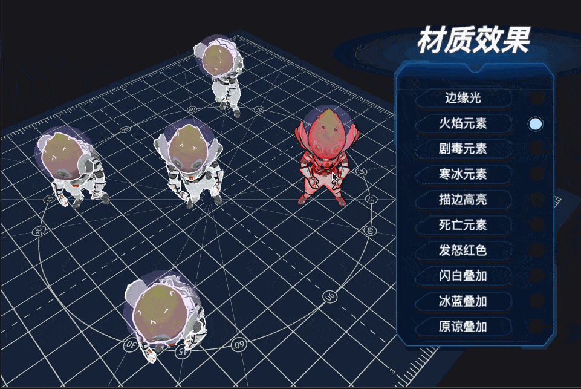
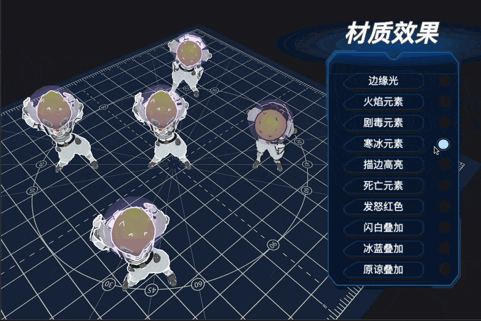
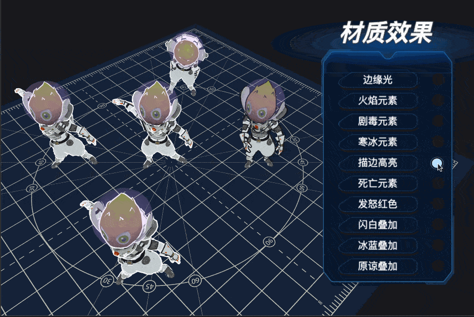
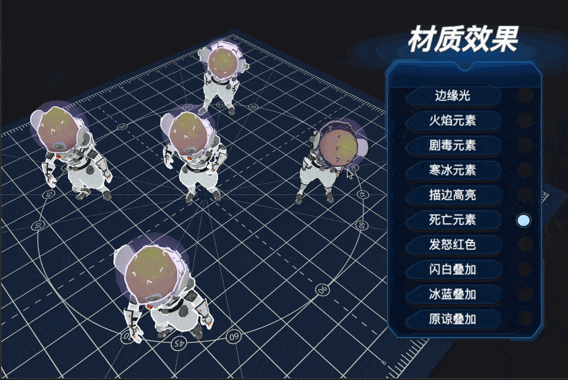
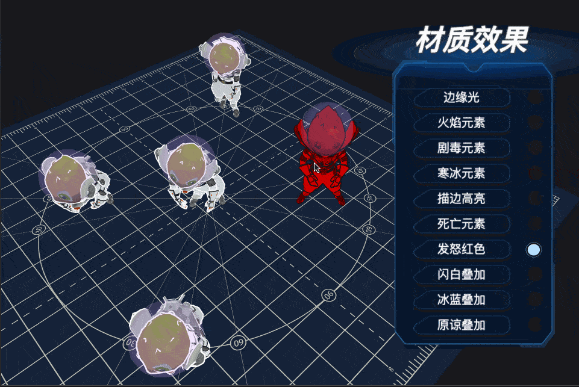
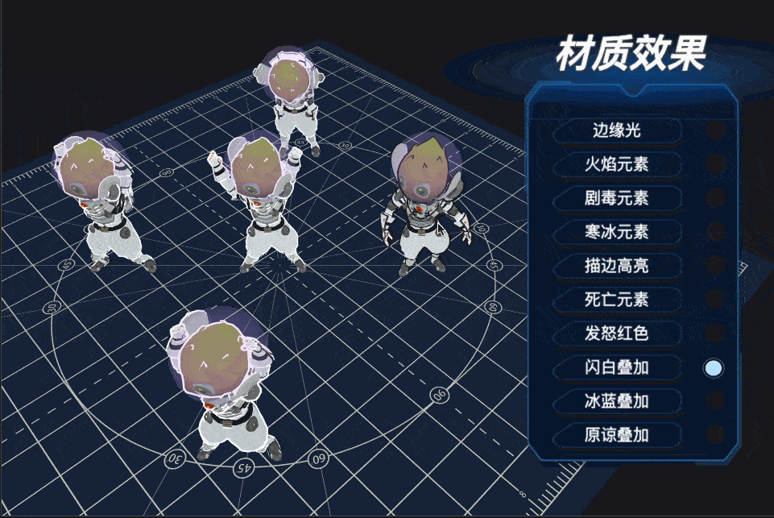
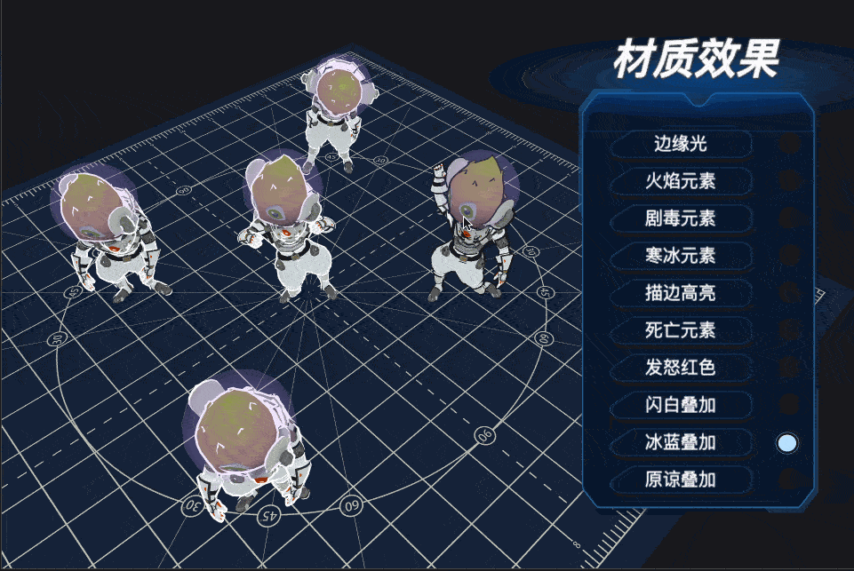
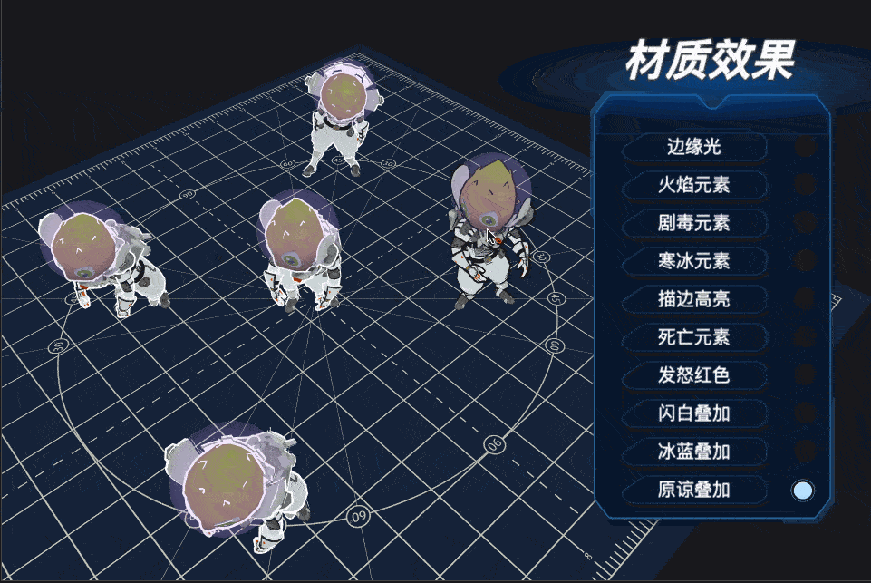

## Cocos Creator Shader

### 简介
基于 CocosCreator 3.5.2 版本创建的 **模型特效** 工程。

### 效果预览
---
#### 边缘光

---

#### 火焰效果

---

#### 剧毒效果

---

#### 寒冰效果

---

#### 描边高亮

---

#### 死亡元素

---

#### 发怒红色

---

#### 闪白叠加

---

#### 冰蓝叠加

---

#### 原谅叠加（绿色叠加）

---

### 相关链接 
https://forum.cocos.org/t/topic/132212