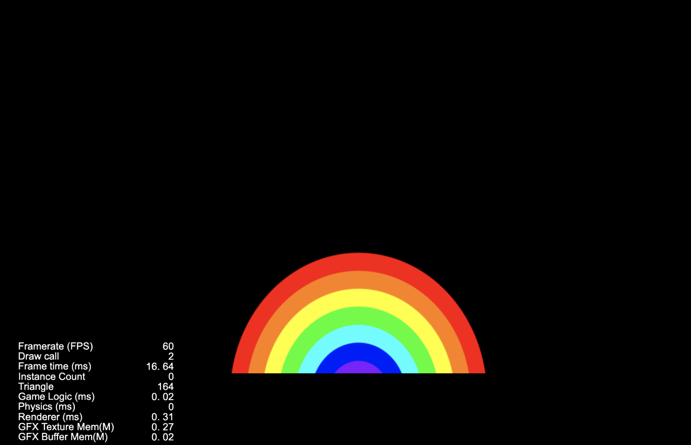
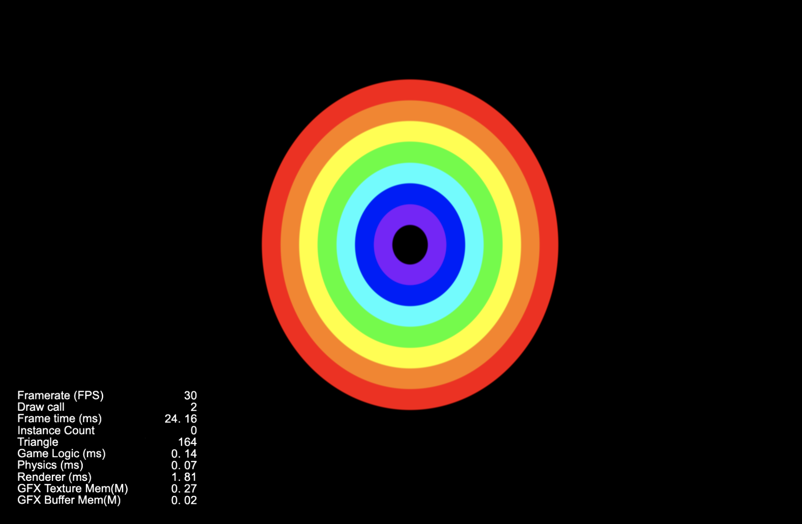

## Cocos Creator Shader

### 简介
基于 CocosCreator 3.0.0 版本创建的 彩虹 工程

### 演示



### 相关链接
https://forum.cocos.org/t/topic/118989

### 实现思路

给图片上色
```ts
void main () {
  // color 是三个浮点数的向量，三个分量可以使用color.x color.y color.z分别访问
  // 也可以color.xy color.xz 作为 vec2 随意组合访问
  // xyz访问的分别是第1，2，3个分量，也可以使用rgb分别访问1,2,3三个分量，没有区别
  // 作为color使用，1,2,3三个分量带别的分别是颜色的红绿蓝三色，三个颜色组合成任意颜色
  // 0.,1.,0. 是红色0 绿色1 蓝色0，最终色是 红色
  vec3 color = vec3(0.,1.,0.);

  // gl_FragColor是最终决定每个像素的颜色的值，
  // vec4.xyz 使用上面的color的值，vec4.w 是1.，这个值得意义是透明度，设为1
  vec4 o = vec4(color, 1);
  gl_FragColor = o;
}
```

画个圈    
```ts
void main () {
  // color 是三个浮点数的向量，三个分量可以使用color.x color.y color.z分别访问
  // 也可以color.xy color.xz 作为 vec2 随意组合访问
  // xyz访问的分别是第1，2，3个分量，也可以使用rgb分别访问1,2,3三个分量，没有区别
  // 作为color使用，1,2,3三个分量带别的分别是颜色的红绿蓝三色，三个颜色组合成任意颜色
  // 0.,1.,0. 是红色0 绿色1 蓝色0，最终色是 红色
  vec3 color = vec3(0.,1.,0.);

  vec2 point = vec2(.5,0.);

  // distance 计算两点距离 这里的point事边缘的中心点，v_uv0是每个像素对应的uv坐标
  float mul = distance(v_uv0,point);
  // step函数，参数1 > 参数2 返回0，否则返回1
  // 这里用step来处理mul，使距离小于0.5的返回值1，大于0.5返回值0
  mul = step(mul,.5);

  // color * mul 对距离在0.5内的像素点，*= 1，颜色值不变，>0.5 时*= 0，使颜色变黑色
  // 结果就是一个圆
  color *= mul;

  // gl_FragColor是最终决定每个像素的颜色的值，
// vec4.xyz 使用上面的color的值，vec4.w 是1.，这个值得意义是透明度，设为1
  vec4 o = vec4(color, 1);
  gl_FragColor = o;
}
```

mul = step(mul,.5) 改成 mul=step(mul,.4) 嘿嘿，画个半径0.4的圆    

把画半圆封装成一个函数吧    
```ts
  float drawHalfCircle(vec2 center,vec2 uv,float radius) {

    float mul = distance(uv,center);
    mul = step(mul,radius);

    return mul;
  }
  
  
  // 参数： center 圆心
  // uv 像素点坐标
  // radius 圆半径
  // width 线宽
  float drawHalfCircleLine(vec2 center,vec2 uv,float radius,float width) {
    float c1 = drawHalfCircle(center,uv,radius);
    float c2 = drawHalfCircle(center,uv,radius - width);
    return c1 - c2;
  }
  
  void main () {
  // 省略重复的代码  .......
    float circleline = drawHalfCircleLine(point,v_uv0,0.5,0.05);
    float ret = circleline;
    color = vec3(0.,1.,0.) * ret;
  // 省略重复的代码  .......
  }  
```

画个彩虹    
```ts
  float circleline1 = drawHalfCircleLine(point,v_uv0,0.5,0.05);
  float circleline2 = drawHalfCircleLine(point,v_uv0,0.45,0.05);
  float circleline3 = drawHalfCircleLine(point,v_uv0,0.4,0.05);

  vec3 colorred = vec3(1.,0.,0.);
  vec3 colorgreen = vec3(0.,1.,0.);
  vec3 colorblue = vec3(0.,0.,1.);
  
  vec3 ret = circleline1 * colorred
    + circleline2 * colorgreen
    + circleline3 * colorblue;
  
  color = ret;
```

边缘有锯齿?    
```ts
  float drawHalfCircle(vec2 center,vec2 uv,float radius) {

    float dis = distance(uv,center);
    // dis = step(dis,radius);
    dis = smoothstep(radius,radius -.005,dis);

    return dis;
  }
```